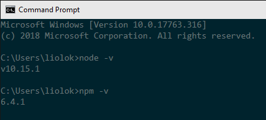
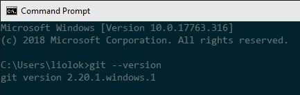
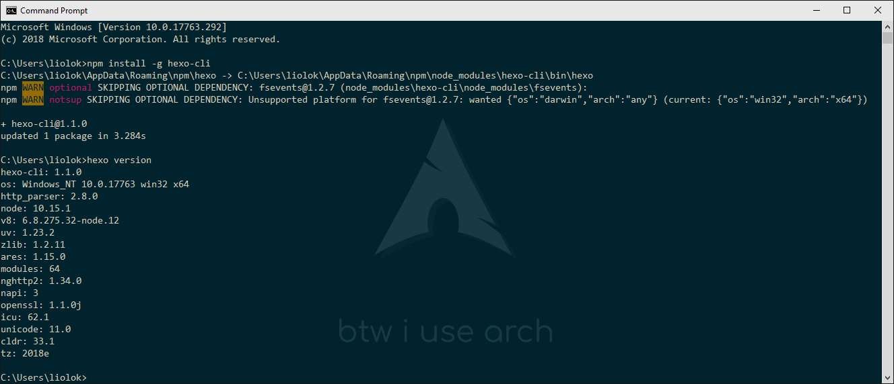
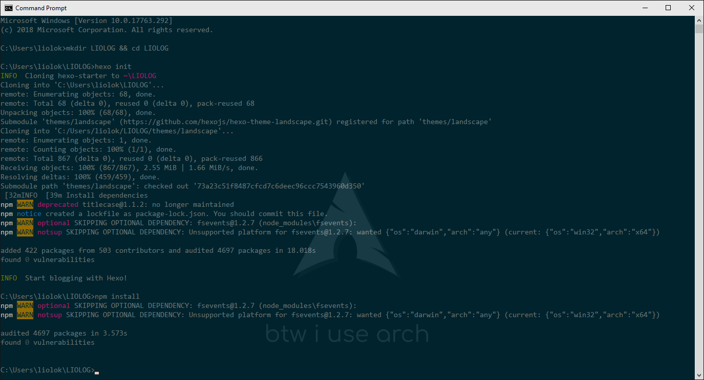
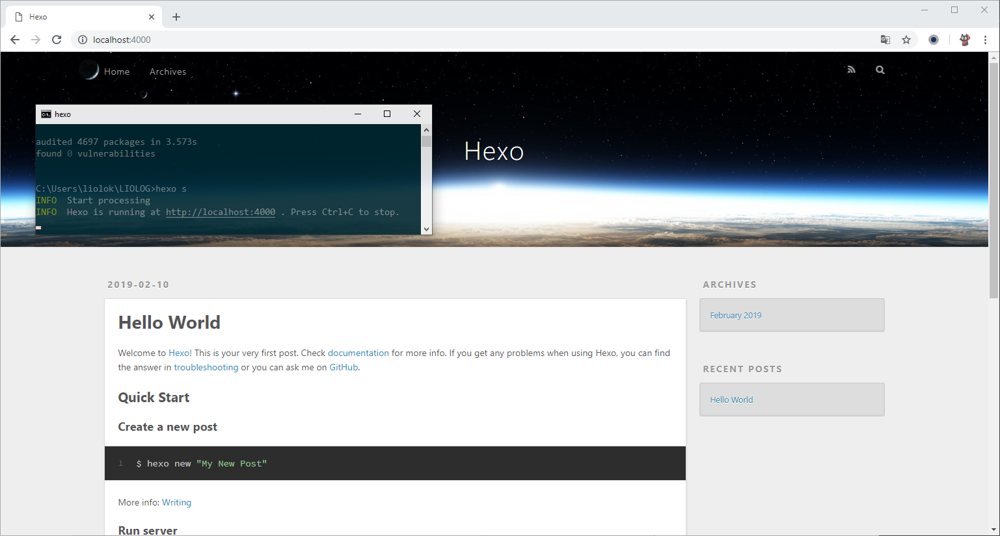
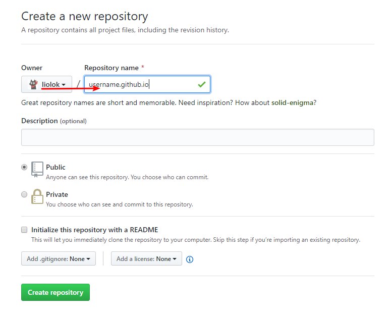
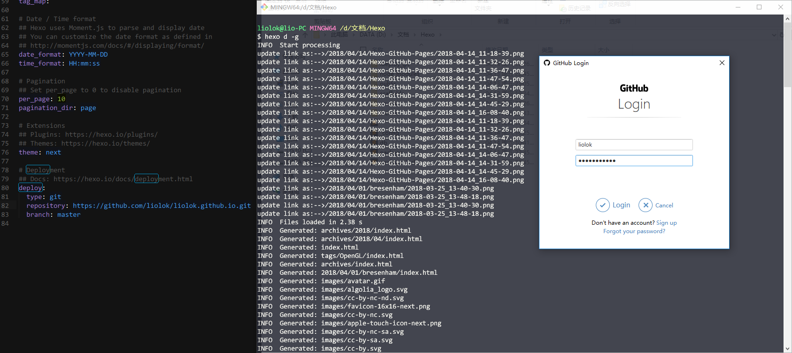

# Build Blog with Hexo and GitHub Pages

## Meta Info

- Published at Apr 14 of 2018
- Updated at Feb 18 of 2019
- [Source code][source]
- [Web page][page] and [zh-Hans version][page_zhs]

[source]: https://github.com/liolok/liolok.com/blob/master/build-blog-with-hexo-and-github-pages/index.md
[page]: https://liolok.com/build-blog-with-hexo-and-github-pages
[page_zhs]: https://liolok.com/zhs/build-blog-with-hexo-and-github-pages

## Local Hexo Instance

> Reference: [Hexo](https://hexo.io/) and its [documentation](https://hexo.io/docs/).

Hexo is a blog framework based on **Node.js**. In this article, we will maintain a Hexo instance on
local machine, and talk about how to publish it to GitHub Pages, which would use **Git** indirectly.

### Prepare Environment

On Arch Linux, you need just one command to do all the work below with your favorite AUR helper:

```shell
$ yay --sync hexo-cli git npm
```

Then you can skip to [initialize instance](#initialize-instance) step.

Yes this is showing off, it's not that simple on most of other platforms.

#### Node.js

Go to [Download - Node.js](https://nodejs.org/en/download/),
choose and install the latest 64-bit LTS version.

After installation, run `node -v` and `npm -v` to verify
both Node.js environment and its package manager:



#### Git

Click this [official link](https://git-scm.com/downloads) to download and install.
VS Code is recommended for default editor, leave other options default if you don't understand,
all these stuff could be configured later.

Run `git --version` to verify installation:



Then configure the user name and email,
the latter should be the same as your [GitHub commit email][gh-commit-email].

[gh-commit-email]: https://docs.github.com/en/github/setting-up-and-managing-your-github-user-account/managing-email-preferences/setting-your-commit-email-address

```shell
$ git config --global user.name "Your Name"
$ git config --global user.email your.mail@example.com
```

#### Hexo

Run `npm install --global hexo-cli` and `hexo version` to install and verify Hexo.

> There may be two warnings like below, saying that an **optional** dependency named `fsevent` was
> skipped since it's macOS only (npm, you have to say, huh?). We can just **ignore** this.



### Initialize Instance

Change to your preferred directory, and run `hexo init name` (use your preferred name) and
`npm install` to establish site and update dependencies. You can also make an empty subdirectory
and run `hexo init` and `npm install` in it, I applied this method below:



Now we got a local folder containing a default blog's source.

### Preview Blog

In site directory run `hexo server` or its abbreviation `hexo s` to start the local server.
You can also run `hexo s -i 192.168.*.*` (use your PC's LAN IP) if want to preview on other devices
in LAN like phones. If you want to change the port or if you’re encountering `EADDRINUSE` errors,
use the `-p` option to set a different port.

According to output, visit `http://localhost:4000`:



Preview operating would be frequent when managing blog,
you may consider to write a script to save time.

## Online GitHub Pages

[What is GitHub Pages?](https://help.github.com/articles/what-is-github-pages/) ——
*GitHub Pages is a **static** site hosting service designed to host your personal，organization
or project pages directly from **a GitHub repository**.*

Of course Hexo is a static blog framework and we already have a Hexo instance on local machine,
now we've got to create a particular repository and configure a bit more,
soon we'll arrive at "*username*.github.io" online.

### Create Dedicated Repository

> Repository naming scheme refers to [types of GitHub Pages sites][gh-pages-sites].

[gh-pages-sites]: https://docs.github.com/en/pages/getting-started-with-github-pages/about-github-pages#types-of-github-pages-sites

[Create a new repository](https://github.com/new) like below,
**replace** `username` with your own (**same** as `Owner` on the left).



### Deploy Blog

> **This chapter is reserved for reference only**: I'm managing blog in a better workflow,
> including auto deployment and more, check out [my CI article][ci-article] (Chinese version only).

[ci-article]: htts://liolok.com/zhs/deploy-hexo-blog-with-git-and-travis-ci/

Reference: [One-Command Deployment - Hexo](https://hexo.io/docs/one-command-deployment#Git)

#### Install Deployer Plugin

Run `npm install --save hexo-deployer-git` under site instance folder.

#### Deployment Configuration

Open site configuration file `_config.yml`, find `deploy:` part and edit:

```yml
deploy:
  type: git
  repo: https://github.com/username/username.github.io  # use your own username
  branch: master
```

Pay attention to syntax of YAML: the colon must be followed by a space.

#### First Deployment

In site folder run `hexo deploy --generate` or its abbreviation `hexo d -g`,
this lets Hexo generate the static files and then deploy blog to repository.



GitHub would verify your identity at first time as above, just login.

Quite soon the blog should be here: https://*username*.github.io.
