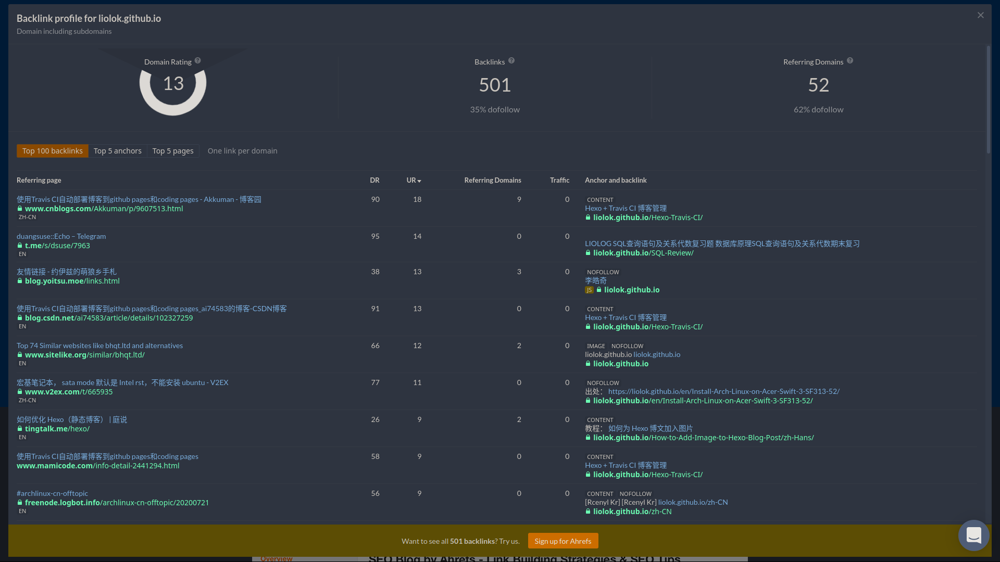

# Fix Broken URLs of My Site

- Published: 2022-04-18
- [Markdown][raw]
- [Simplified Chinese][zhs]

[raw]: https://raw.githubusercontent.com/liolok/liolok.com/master/fix-broken-urls-of-my-site/index.md
[zhs]: https://liolok.com/zhs/fix-broken-urls-of-my-site/

## Problem

URLs should've been permanent, however due to kinds of situations, URLs that referenced by other websites will lead to 404 page or even worse.

As for my own situation: I tried several URL styles in this few years, for example in URL of an article written in Chinese, should I include Chinese or using English only, and using title case or not. I also changed my mind about using GitHub Pages subdomain, migrated to my own custom domain.

When you look up for something on Internet, sometimes webpage or even the whole website just can't open. It may be shut down and unmaintained for good, but also may be in a situation like mine: article migrated to a new URL.

I always feel disappointed when I happen to open a broken URL, so it's such a Karma that I broke my own URLs: People consider my article worthy to reference, I should not fail them and leave things broken.

I came up with two solutions:

1. Inform people that my webpage has been migrated, request for updating the reference link:
    - Pro: Seamless visiting experience
    - Con: How to reach people? I'd also feel kind of shame to trouble others for my own problem.
2. Perform automatically redirection on old broken webpage:
    - Pro: No need to change the references
    - Con: May be bad for visiting experience, confusing, breaking.

## Find Referenced Broken URLs

More realistic case is: my article has been not referenced at all, there is nothing to fix, nobody would ever click on the broken URL.

It's the referenced broken URLs that should be concerned, I tried to find them over search engine, found some but still felt not quite satisfied.

So this time I discovered this online tool: [ahrefs.com/backlink-checker](https://ahrefs.com/backlink-checker).

Using for free charge without signing up, you can reverse search:

- Certain exact URL
- All URLs under certain domain (forced including subdomain)

on their "backlinks", limited to top 100 results.



## Old URL Auto Redirect

Redirection could also be implement by HTTP status code 301/302, but this method doesn't suit my case so I didn't dig in.

Write a HTML on [old URL][old_url] to achieve automatic redirection to [new URL][new_url]:

[old_url]: https://liolok.github.io/V2Ray-Subscription-Parse/
[new_url]: https://liolok.com/v2ray-subscription-parse/

> Note: If using directory style URL (pretty URL), like me, the HTML file should locate under corresponding directory with name `index.html`.


```html
<!DOCTYPE html>
<html lang="en-US">

<head>
    <meta charset="utf-8">
    <meta http-equiv="X-UA-Compatible" content="IE=edge">
    <meta name="viewport" content="width=device-width, initial-scale=1">
    <meta http-equiv="refresh" content="3; url=https://liolok.com/v2ray-subscription-parse/">
    <link rel="canonical" href="https://liolok.com/v2ray-subscription-parse/">
    <title>Site Moved</title>
</head>

<body>
    <h1>Site Moved</h1>
    <p><a href="https://liolok.com/v2ray-subscription-parse/">Redirecting to my new site...</a></p>
</body>

</html>
```

Core code is that line of [meta refresh](https://en.wikipedia.org/wiki/Meta_refresh). `content` parameter contains a delay interval like 3 or 5 seconds, and the new URL to redirect.

## Conclusion

To keep permanent URLs available, basic solutions are:

1. Do **NOT** change path to your webpage
2. Do **NOT** change domain of your website
3. Do **NOT** lose your domain
4. Hope human civilization not falling so hard that Internet down for good
5. Try to live forever for maintaining your website

That's all, wish you guys good health and long live.
