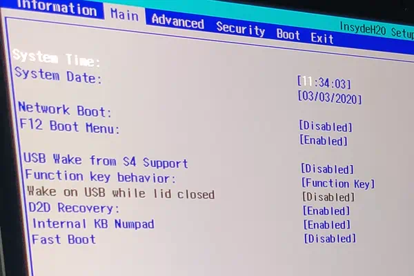

# Install Arch Linux on Acer Swift 3 SF313-52

- Published: 2020-02-28
- [Markdown][raw]

[raw]: https://raw.githubusercontent.com/liolok/liolok.com/master/install-archlinux-on-acer-swift-3-sf313-52/index.md

## Pre-installation

User Manual from Acer's [product support page][support-page] told me to press F2 to get in BIOS settings, but nothing much more than that.

Secure boot failed, need to disable this feature. Option grayed out? Google brought me [here][disable-secure-boot]. So set supervisor password, disable secure boot and boot into archiso.

First command to run after archiso boots:

```console
# setfont latarcyrheb-sun32
```

Then I could see the characters clear, for more information go read the ArchWiki about [HiDPI#Linux_console][hidpi].

Run `wifi-menu` or just plug in phone with USB tethering to connect network, and `ping archlinux.org -c 4` to verify.

### Fake RAID

`lsblk` / `fdisk -l` to check hard drive, no NVMe SSD shown, what the...

Thanks to Intel's iRST, Linux couldn't access SSD out-of-box under fake RAID mode, need to change SATA mode to AHCI.

But there's no option to change SATA mode in BIOS settings, lots of options are hidden, you got me Acer.

After tons of search I got the solution in this [thread][acer-thread]: Press `Ctrl + S` in "Main" tab of BIOS settings, then the option will show up.

[acer-thread]: https://community.acer.com/en/discussion/583248/change-sata-mode-to-ahci "Change SATA mode to AHCI - Acer Aspire 3 A315-54K-59NZ — Acer Community"



This is the first and last time I buy from Acer, that's it.

After changing SATA mode to AHCI, reboot into archiso then start installation over again.

---

Set large font, connect network, check hard drive, now there should be a `nvme0n1` device.

Create partitions within a simple layout, just ESP and root, swapfile should works fine on XFS.

Run `cgdisk` and type `/dev/nvme0n1`, delete original partitions. Create a 512MiB ESP with code `EF00` and name `ESP`, rest room for root with name `ALL`. Before quit remember to **write** partition table to save changes.

Run `lsblk -o+partlabel` to see partitions status now, then format and mount them:

```console
# mkfs.xfs /dev/nvme0n1p1 # use XFS for root
# mkfs.fat /dev/nvme0n1p2 -F32 # FAT32 for ESP
# mount /dev/nvme0n1p1 /mnt
# mount /dev/nvme0n1p2 /mnt/boot # mount ESP to /boot
```

## Installation

Run `nano /etc/pacman.d/mirrorlist` to select a closer or preferred mirror server:

`Ctrl + W` and search for country or domain, uncomment the line then `Ctrl + O` to save and `Ctrl + X` to exit.

Install essential packages to root partition, finally:

```console
# pacstrap /mnt base linux linux-firmware \
> xfsprogs \ # userspace utilities for XFS
> netctl dhcpcd wpa_supplicant dialog \ # ethernet cable and wireless network
> nano \ # Sorry darling but I only know how to exit vi
> man-db man-pages texinfo # documentation
```

Generate `fstab` file by `genfstab -U /mnt >> /mnt/etc/fstab` and change root into the fresh new system: `arch-chroot /mnt`.

Set [time zone][time-zone], [localization][localization] and [network configuration][network configuration].

Creating a new initramfs by `mkinitcpio -P` and set root password with `passwd`.

Install microcode with `pacman --sync intel-ucode` and install [systemd-boot][sd-boot] into ESP: `bootctl --path=/boot install`.

> After installing a AUR helper or adding archlinuxcn repo, remember to install `systemd-boot-pacman-hook` to update systemd-boot in ESP automatically.

Config systemd-boot, edit `/boot/loader/loader.conf`:

```
default arch
timeout 4
```

> After booting system successfully later, `timeout` line could be commented out to speed up startup.

Then edit `/boot/loader/entries/arch.conf`:

```
title   Arch Linux
linux   /vmlinuz-linux
initrd  /intel-ucode.img
initrd  /initramfs-linux.img
options root=PARTLABEL=ALL rw
```

> `ALL` is the name of root partition. Don't confuse `PARTLABEL` with `LABEL`.

> Keep in mind that the `options` line contains kernel parameters and may be mentioned later.

A minimal installation is basically completed now, `Ctrl + D` or `exit` to quit `arch-chroot` and `umount -R /mnt` then reboot into Arch Linux.

## Post-installation

```console
# wifi-menu # connect to network (or just plug in cable)
# ping archlinux.org -c 4 # verify network
# pacman --sync sudo # prepare for admin user
# nano /etc/sudoers # uncomment "%wheel ALL=(ALL) ALL" line
# useradd liolok --create-home --groups wheel # create admin user
# passwd liolok # set admin password
# pacman --sync gnome # install Gnome as desktop environment
# systemctl enable gdm # enable Gnome's display manager
# reboot # reboot into GUI
```

Select some configs from this [ArchWiki][swift-5-config] of Acer Swift 5 SF515-51T.

Kernel boot parameters (append to `options` line of `/boot/loader/entries/arch.conf`):

- `i915.i915_enable_rc6=1` to enable deeper sleep states (power saving);
- `i915.i915_enable_fbc=1` to enable framebuffer compression (power saving).

Kernel modules parameters (new lines to `/etc/modprobe.d/swift313-52.conf`):

- `options snd-intel-dspcfg dsp_driver=1` to use DSP sound driver (legacy) instead of SOF (after linux-5.4) to **fix no sound issue** ("dummy output" in Gnome settings);
- `options snd-hda-intel model=dell-headset-multi` to detect headset mic for sound capture;
- `options snd-hda-intel power_save=1` for sound power saving.

One more strange bug: can't power off after shutdown system, laptop still running with screen blank or frozen.

Tons of search and solutions, finally "solved" by [disabling `VT-d` feature][vtd-thread] in BIOS. Need to explore this later.

[support-page]: https://www.acer.com/ac/en/US/content/support-product/8233
[disable-secure-boot]: https://superuser.com/questions/1324323/how-to-disable-secure-boot-on-an-acer-aspire-3-laptop "bios - How to disable Secure Boot on an Acer Aspire 3 laptop? - Super User"
[hidpi]: https://wiki.archlinux.org/index.php/HiDPI#Linux_console
[acer-ssd-thread]:https://community.acer.com/en/discussion/582666/no-access-to-internal-ssd-when-outside-win10-on-an-acer-swift-5-sf514-54t "No access to internal SSD, when outside Win10 on an Acer Swift 5 SF514-54T — Acer Community"
[time-zone]: https://wiki.archlinux.org/index.php/Installation_guide#Time_zone
[localization]: https://wiki.archlinux.org/index.php/Installation_guide#Localization
[network configuration]: https://wiki.archlinux.org/index.php/Installation_guide#Network_configuration
[sd-boot]: https://wiki.archlinux.org/index.php/Systemd-boot
[swift-5-config]: https://wiki.archlinux.org/index.php/Acer_Swift_5#Configuration
[vtd-thread]: https://bbs.archlinux.org/viewtopic.php?pid=1613091#p1613091
