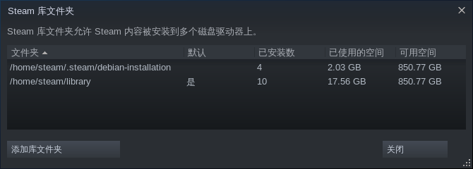

# 使用 systemd-nspawn 容器化 Steam

- 发布于 2021 年 8 月 16 日
- 更新于 2021 年 8 月 31 日
- [源码][source]
- [网页][page_zhs]以及[英文版][page]

[source]: https://github.com/liolok/liolok.com/blob/master/zhs/containerize-steam-with-systemd-nspawn/index.md
[page]: https://liolok.com/containerize-steam-with-systemd-nspawn/
[page_zhs]: https://liolok.com/zhs/containerize-steam-with-systemd-nspawn/

---

- [创建 Btrfs 子卷](#创建-btrfs-子卷)
- [安装最小化的 Ubuntu](#安装最小化的-ubuntu)
- [网络](#网络)
- [区域设置](#区域设置)
- [安装 Steam](#安装-steam)
- [其他准备工作](#其他准备工作)
- [设备直通](#设备直通)
  - [显卡](#显卡)
  - [手柄](#手柄)
- [包装一下](#包装一下)
- [游戏问题](#游戏问题)
  - [饥荒联机版](#饥荒联机版)
    - [没声音](#没声音)
  - [植物大战僵尸年度版](#植物大战僵尸年度版)
    - [植物选择界面掉帧](#植物选择界面掉帧)
  - [Beholder](#beholder)
    - [中日韩字体空白](#中日韩字体空白)

---

## 创建 Btrfs 子卷

```console
# su # 切换到 root 用户
# cd /var/lib/machines
# container_name=steam
# btrfs subvolume create $container_name
```

然后就可以方便地对容器进行[快照][snapshot]以及[迁移][migrate]了。

[snapshot]: https://wiki.archlinux.org/title/Btrfs#Snapshots
[migrate]: https://wiki.archlinux.org/title/Btrfs#Send/receive

## 安装最小化的 Ubuntu

> 参考：[systemd-nspawn - ArchWiki](https://wiki.archlinux.org/title/Systemd-nspawn#Create_a_Debian_or_Ubuntu_environment)

当前最新的长期支持版 Ubuntu 代号为 `focal`。随你选用喜欢的仓库地址。

```console
# codename=focal
# repository_url='https://mirrors.ustc.edu.cn/ubuntu/'
# debootstrap --include=systemd-container \
--components=main,universe,multiverse \
$codename $container_name $repository_url
```

安装完成后，运行 `systemd-nspawn --machine=$container_name` 即可启动进入崭新的容器。

## 网络

可能需要加上 `--bind-ro=/etc/resolv.conf` 参数才能让容器里的 DNS 正常工作。

想要检查网络状态的话，可以使用命令 `ping 1.1.1.1` 和 `ping archlinux.org`：如果前者通后者不通，说明是 DNS 问题。

## 区域设置

> 参考：[生成区域设置 - ArchWiki](https://wiki.archlinux.org/title/Locale_(简体中文)#生成区域设置)

设置 `en_US.UTF-8` 区域，否则 Steam 会报一些错。

## 安装 Steam

在容器内，[启用 32 位架构][multiarch]并从 Ubuntu 官方仓库安装[软件包][package]：

[multiarch]: https://wiki.debian.org/Multiarch/Implementation#Using_multiarch
[package]: https://packages.ubuntu.com/focal/steam

```console
# dpkg --add-architecture i386
# apt-get update
# apt-get install steam
```

根据[文件列表][filelist]判断，Steam 的启动脚本位于 `/usr/games/steam`。我们创建一个符号链接以便启动：

[filelist]: https://packages.ubuntu.com/focal/i386/steam/filelist

```console
# file /usr/games/steam
# ln --verbose --symbolic /usr/games/steam /usr/local/bin/
```

在容器从添加一个专门的普通用户，就叫「steam」吧。再创建一下基础目录：

```console
# useradd --create-home steam
# su --login steam --shell /bin/bash
# mkdir --parents ~/.config ~/.local/share
```

后续我还创建了 `~/library` 目录来作为自定义的 Steam 默认库文件夹，并挂载了一个
`~/screenshots` 目录以便在宿主机上存储截图。


## 其他准备工作

- 显示：[Xorg][xorg]
- 托盘：[DBus][dbus]
- 音频：[PulseAudio][pulseaudio]
- 光标：[图标主题][styles]

命令行参数已然太多，从这一步开始，想要在图形界面运行 Steam 就要着手撰写脚本了。

[xorg]: https://liolok.com/run-desktop-app-with-systemd-nspawn-container/#xorg
[dbus]: https://liolok.com/run-desktop-app-with-systemd-nspawn-container/#dbus-tray
[pulseaudio]: https://liolok.com/run-desktop-app-with-systemd-nspawn-container/#pulseaudio
[styles]: https://liolok.com/run-desktop-app-with-systemd-nspawn-container/#styles

## 设备直通

### 显卡

- 设备文件：
  - Intel 或 AMD：`--bind=/dev/dri/card0` 以此类推
  - NVIDIA：`--bind=/dev/nvidia0` 以此类推
- 访问权限：`--property=DeviceAllow='char-drm rw'`

### 手柄

- 设备文件：`--bind-ro=/dev/input/js0` 以此类推
- 访问权限：`--property=DeviceAllow='char-input r'`

## 包装一下

- [fish-shell 脚本][script]：包装 `systemd-nspawn` 命令
- [桌面文件][desktop-entry]

[script]: https://github.com/liolok/dotfiles/blob/master/.local/bin/steam
[desktop-entry]: https://github.com/liolok/dotfiles/blob/master/.local/share/applications/steam.desktop

## 游戏问题

### 饥荒联机版

#### 没声音

这个游戏使用 [FMOD 引擎][fmod]，貌似 *[明确依赖 ALSA][alsa]*。无法播放任何音频，持续将音量重置为零。

[alsa]: https://wiki.archlinux.org/title/Steam/Troubleshooting#Configure_PulseAudio
[fmod]: https://wiki.archlinux.org/title/Steam/Troubleshooting#FMOD_sound_engine

解决方案：
- Debian/Ubuntu: `apt-get install pulseaudio`
- Arch Linux: `pacman --sync pulseaudio-alsa --assume-installed pulseaudio`

<!-- #### CJK Font Messed Up -->

### 植物大战僵尸年度版

（通过 Steam Play 运行）

#### 植物选择界面掉帧

> 来源：[AngrySpaceElf@ProtonDB](https://www.protondb.com/app/3590#l7L1gAH52v)

使用非 DRM 版本的可执行文件（3.4MiB）替换 DRM 版（5.1MiB）。

我把自己的非 DRM 版可执行文件上传到了这里：[pvz-non-drm.tar.xz](../../containerize-steam-with-systemd-nspawn/pvz-non-drm.tar.xz)，附带了它的
SHA-256 校验和：`cdddfb30f50510afa389de4966089a1ac1a9a2bf09fb8d0aa0793178b0814cd1`

下面是提取非 DRM 版可执行文件然后替换的完整步骤：

1. 全新安装；
2. 初次启动游戏，**不要退出**；
3. 切换到对应的库文件夹，比如我的：`cd /home/steam/library`；
4. 复制 `steamapps/compatdata/3590/pfx/drive_c/ProgramData/PopCap Games/PlantsVsZombies/popcapgame1.exe` 到 `/tmp/`；
5. 退出游戏；
6. 复制 `/tmp/popcapgame1.exe` 到 `steamapps/common/Plants\ Vs\ Zombies/PlantsVsZombies.exe` 并将后者覆盖，完事。

库文件夹在哪儿？到「设置 -> 下载 -> 内容库」打开配置对话框：



### Beholder

#### 中日韩字体空白

> Source: [求助，游戏打开后没有字 :: Beholder General Discussions](https://steamcommunity.com/app/475550/discussions/0/2592234299563997618/?ctp=2#c1480982971155734475)

这个游戏严格依赖「文泉驿微米黑」字体，在 Ubuntu 20.04 上其包名为 `fonts-wqy-microhei`：

```console
# systemd-nspawn --machine=steam --bind-ro=/etc/resolv.conf apt install fonts-wqy-microhei
```

如果没效果，可能需要手动刷新一下 `fontconfig`：

```console
# systemd-nspawn --machine=steam fc-cache --force --verbose
```
