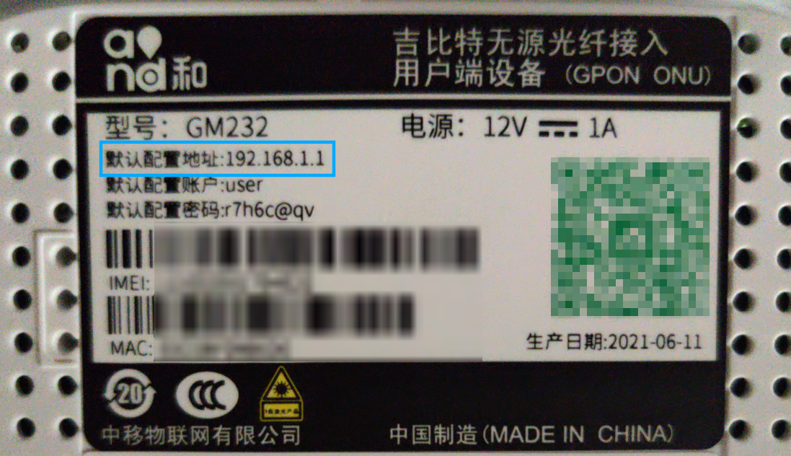
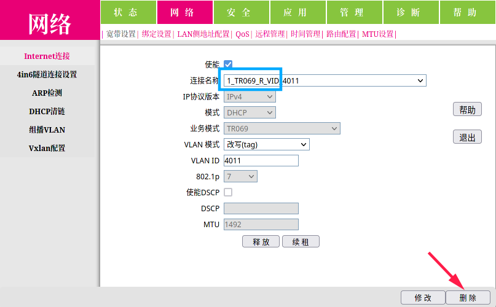
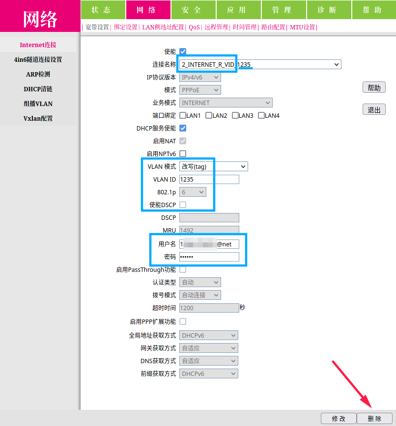
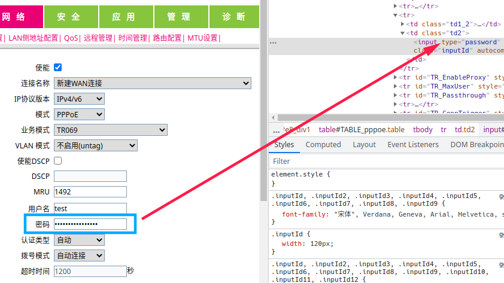
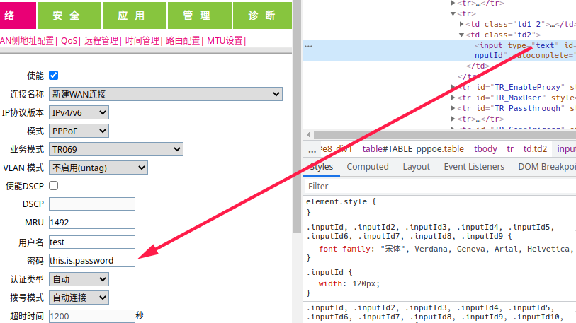
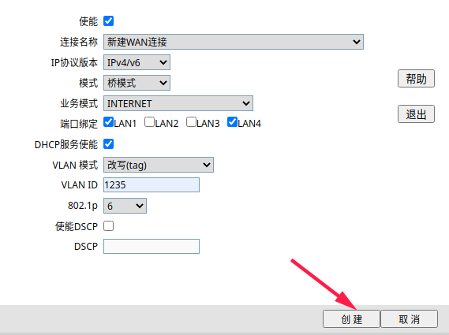

# 折腾中国移动家用宽带

- 发布于 2021 年 7 月 19 日
- [源码][source]
- [网页][page]

[source]: https://github.com/liolok/liolok.com/blob/master/zhs/customize-china-mobile-home-broadband/index.md
[page]: https://liolok.com/zhs/customize-china-mobile-home-broadband/

---

- [进入光猫配置](#进入光猫配置)
  - [超级管理账户](#超级管理账户)
  - [备份默认配置](#备份默认配置)
- [自动获取 IPv6 公网地址](#自动获取-ipv6-公网地址)
  - [删除远程配置下发连接](#删除远程配置下发连接)
  - [删除原有拨号连接](#删除原有拨号连接)
  - [添加桥接网络](#添加桥接网络)
  - [路由器拨号](#路由器拨号)
  - [测试网站](#测试网站)
  - [参考文章](#参考文章)

---

## 进入光猫配置

我的路由器是斐讯 K2P，光猫型号是吉比特 GM232。四个 LAN 口：第一个是千兆，其他三个是百兆。默认配置地址如图：

局域网连接情况：

- 光猫千兆 LAN 口、路由器 WAN 口；
- 路由器 LAN 口、个人电脑。

只要在局域网内，个人电脑应该都是可以直接访问光猫配置地址的。如果不能，可以尝试修改电脑的局域网 IP 到与光猫同一网段，如 `192.168.1.2`。

### 超级管理账户

默认的普通账户权限受限。按型号查找超管账户为：

- 账户：`CMCCAdmin`
- 密码：`aDm8H%MdA`

### 备份默认配置

说是备份，其实就是把将会修改的配置页面截图存档，主要是为了方便对照。如果真的出问题，随时可以恢复出厂设置。

## 自动获取 IPv6 公网地址

### 删除远程配置下发连接

这个 TR069 网络协议是用来下发配置的，删掉以绝后患。

### 删除原有拨号连接

删除默认的拨号网络连接之前先注意相关参数，之后创建桥接网络连接会需要。

当然，如果这一步中的信息都是可以修改的，也可以参照下一步直接修改。

拨号的宽带账号密码肯定是需要记下的。如果像上图一样，没有显示密码的按钮的话，直接在输入框右键检查元素、将 `type` 标签从 `password` 修改为 `text` 甚至其他任意值即可显示密码。实在不行，拨号的账密也可以直接向运营商询问，这点信息总还是有义务告知用户的。

强制显示密码

### 添加桥接网络

IP 协议当然是双栈，模式是桥接（bridge），业务模式跟拨号连接一致。

端口绑定必选 LAN1 即千兆口，其他三个主要取决于其他业务有没有占用。

VLAN 模式跟 ID 等其他参数也要与默认的拨号连接中保持一致。

### 路由器拨号

接下来只要在路由器配置中正常 PPPoE 拨号就可以获取到自动分配的 IPv6 公网地址了，至于 v4 显然是不可能的。不过好歹也是公网 IP 地址，有总比没有强。

### 测试网站

- https://test-ipv6.com/
- https://speed.neu6.edu.cn/

### 参考文章

- 2021-02-14 [移动宽带之私有云解决方案——光猫桥接及IPV6拨号 - 风之章](https://post.smzdm.com/p/aqxpwx3v/)
- 2020-04-20 [中国移动进光猫超管必做的几件事 - Mr.loading](https://www.iamydp.cn/archives/60.html)
