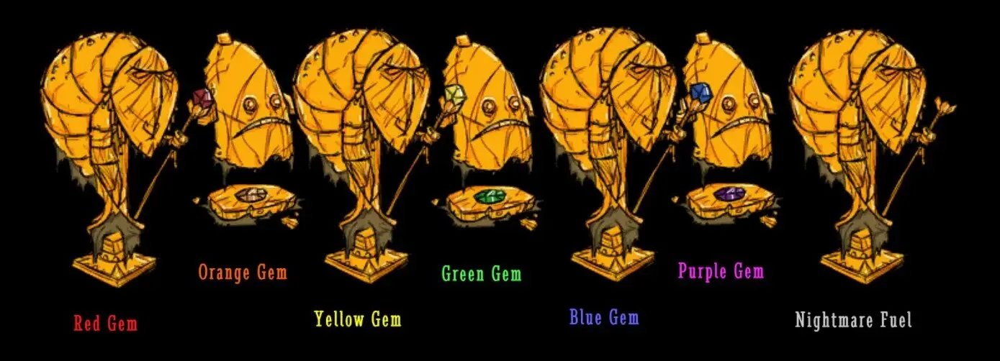
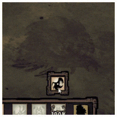
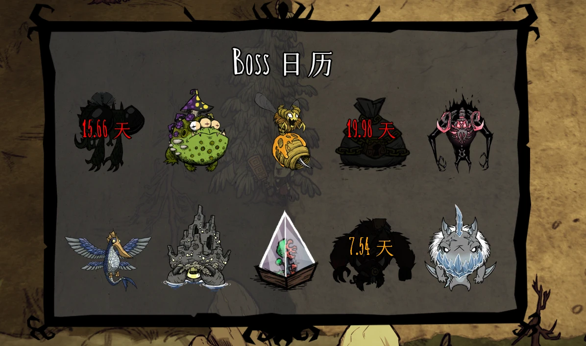
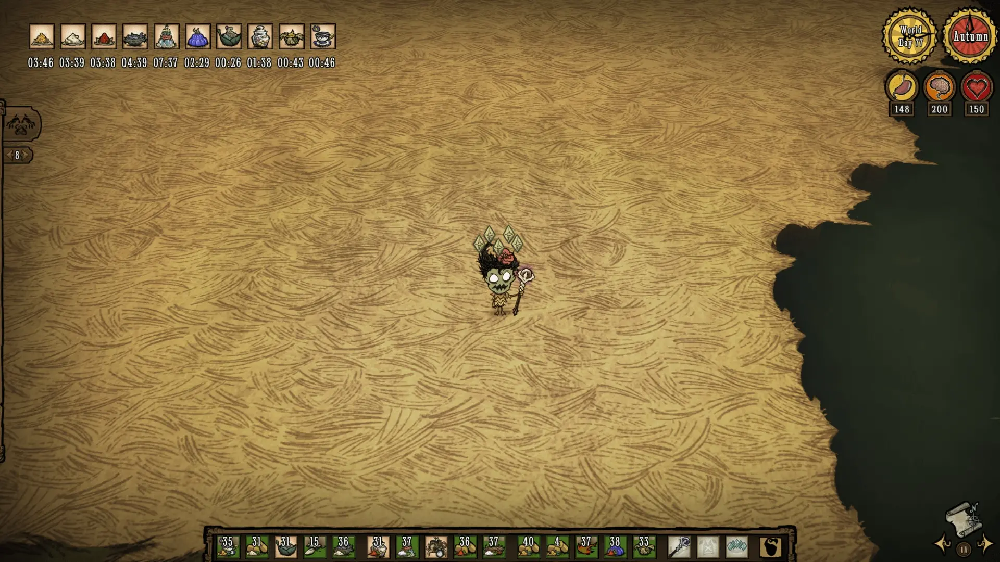
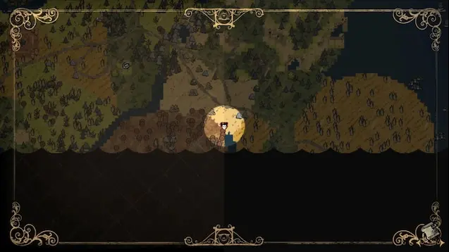
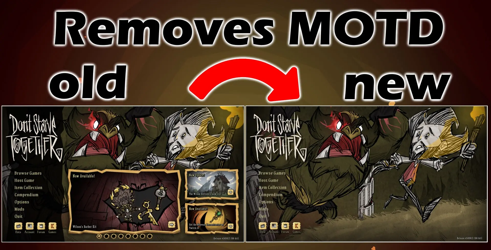
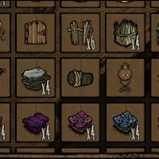

# 饥荒联机版客户端模组自用列表

- 发布于 2022 年 2 月 23 日
- 更新于 2023 年 8 月 15 日
- [Markdown][raw]
- [Steam 创意工坊合集](https://steamcommunity.com/sharedfiles/filedetails/?id=2761751472)

[raw]: https://raw.githubusercontent.com/liolok/liolok.com/master/zhs/dont-starve-together-client-mod/index.md

## Action Queue

> 关键词：操作

这个模组有很多版本，这里推荐的是 Cutlass 维护的 RB3：

- ID：`2873533916`
- [链接](https://steamcommunity.com/sharedfiles/filedetails/?id=2873533916)

默认绑定 LShift + 鼠标双击来批量操作，比如砍、挖、捡、种、采等等，可以设置双击速度、范围。

默认绑定 F3 切换显示附近地皮网格，默认半径 5 个地皮也就是以人物所在地皮为中心的 11*11 的地皮网格。

默认绑定 F4 切换自动收集（默认为关闭状态），操作队列中会增加捡起附近地面物品的操作，可用于砍树挖矿之类的场景。

默认绑定 C 键快速制作上一次制作过的东西，可用于连续制作/建造的场景。

此外还要推荐一个基于此进行加强的模组：QuickAction for ActionQueue

- ID：`2753482847`
- [链接](https://steamcommunity.com/sharedfiles/filedetails/?id=2753482847)

主要解决的痛点就是 Shift 双击物体的时候不再需要装备上对应的工具才能触发批量操作：
这个模组会自动帮你切换手杖和工具，快速走到树/矿石之后再切换工具进行砍伐/开采。

## Advanced Controls

> 关键词：操作

- ID：`1601725838`
- [链接](https://steamcommunity.com/sharedfiles/filedetails/?id=1601725838)

物品方面：
- 使用光标或者 Shift + 右键将物品放到地面上时，自动对准距离最近的墙点再进行放置
  - 使用 Ctrl + Shift + 右键单独放置物品时强制放到人物脚下
- 禁止右键食用稀有物品的功能，比如巨鹿眼球、远古守护者的犀牛角、曼德拉草

攻击方面：
- 每次按下 F 重新选择距离最近的怪作为目标
- 墙需要用 Ctrl + 左键进行强制攻击
- 食人花、蜂王的小蜜蜂、蚁狮的沙刺需要强制攻击
- 使用韦伯角色时，蜘蛛需要强制攻击
- 装备骨头头盔时，影怪需要强制攻击

<!-- 易引起冲突崩溃，暂不推荐
## Advanced Tooltips

> 关键词：信息、反向推算

原版早已停更，这里推荐的是 Viento Solar 维护的版本：
- ID：`1870100421`
- [链接](https://steamcommunity.com/sharedfiles/filedetails/?id=1870100421)

Tooltip 就是指光标悬停格子里的物品时，光标上方浮现的文字提示。这个模组主要展示以下信息：
- 食物的三维变动数值（据我测试是适配了机器人、恶魔人、旺达的）
- 食物距离腐烂的剩余时间：
  - 可以修改为各个阶段的剩余时间，如由绿变黄、由黄变红以及最终腐烂
  - 适配冰箱、寒冰切斯特的二倍保鲜（很遗憾背包类容器并未适配，比如保鲜背包和种子袋）
  - 适配盐箱的四倍保鲜
  - 适配夏冬的环境温度影响
- 装备的伤害数值、防水百分比、保暖隔热数值、速度加成（需手动开启）
- 武器、工具的剩余使用次数/总使用次数
- 护甲的剩余血量/总血量
- 衣物、灯具等装备的剩余时长/总时长
- 暖石的温度，这个只对本地主机生效且不会实时更新，比较鸡肋建议关闭
- 可以将装备图标上面的耐久度百分比改为剩余时长、剩余使用次数
- 可以将护甲图标上面的耐久度百分比改为剩余血量

所有涉及时长的值，默认大于游戏一天（现实八分钟）则为天数，例如：`5.8d/25d`；
小于游戏一天则为分秒，如：`6:34/7:48`。也可以统一改为现实时间的分秒格式。

> 注：该模组容易引起冲突以及崩溃，如果遇到问题可以尝试禁用。
-->

## Advanced Warning

> 关键词：信息、文字提醒

- ID：`1923504381`
- [链接](https://steamcommunity.com/sharedfiles/filedetails/?id=1923504381)

在巨鹿、熊獾、猎犬、蠕虫、蚁狮的地陷和落石预警开始时，发出清晰直观的文字提示。
可以调整成屏幕上方提示或者发送全房聊天消息。静音或者听歌的游玩场景下比较急需本模组。

## Ancient Statue Gem Names

> 关键词：信息、界面

- ID：`2865851895`
- [链接](https://steamcommunity.com/sharedfiles/filedetails/?id=2865851895)

在洞穴的远古遗迹中，给每个铥矿雕像下方加上带有颜色的文字，标明所镶嵌的宝石种类/噩梦燃料：

## Auto-Recall Abigail

> 关键词：自动操作、温蒂、阿比盖尔、角色相关

- ID：`2227491828`
- [链接](https://steamcommunity.com/sharedfiles/filedetails/?id=2227491828)

当阿比盖尔的生命值低于 25% 时，这个客户端模组会自动召回她。
这可以防止阿比盖尔完全死亡并将她的生命值上限重置为 150。

可以在模组设置里调整：
- 召回阿比盖尔的血量百分比阀值
- 召回被打断之后再次尝试召回的缓冲秒数

## Auto Re-Equip Weapons

> 关键词：自动操作、装备、武器、攻击

- ID：`2095062694`
- [链接](https://steamcommunity.com/sharedfiles/filedetails/?id=2095062694)

当一把武器打坏之后会自动装备上另一把同种武器。
默认自动选用耐久度最低的那一把，在设置中可以关闭。

## Auto Refuel

> 关键词：自动操作、装备、燃料

- ID：`2130351510`
- [链接](https://steamcommunity.com/sharedfiles/filedetails/?id=2130351510)

自动为以下装备添加燃料：
- 魔光护符
- 懒人护符
- 矿灯帽
- 提灯
- 鼹鼠帽
- 骨甲
- 警钟
- 暗影秘典

每一种装备都有对应的设置，可以调整是否自动添加以及百分比阀值。

## Auto Replace Bone Armor

> 关键词：自动操作、装备

- ID：`2129374112`
- [链接](https://steamcommunity.com/sharedfiles/filedetails/?id=2129374112)

自动切换骨甲，也支持自动给骨甲添加燃料（也可以设置百分比阀值）。

> 这个模组的图片是不是非常可爱！这位作者还有一款海钓辅助的模组，喜欢钓鱼的玩家可以看看。

## Auto Unequip

> 关键词：自动操作、装备

- ID：`2706972372`
- [链接](https://steamcommunity.com/sharedfiles/filedetails/?id=2706972372)

一些装备耐久度耗尽会直接消失不见，失去原本可能的修补机会，俗称爆掉。这个模组会在危急时刻自动卸下装备。

## Beefalo Keybind

> 关键词：自动操作、按键绑定

- ID：`2964797588`
- [链接](https://steamcommunity.com/sharedfiles/filedetails/?id=2964797588)

一键骑牛/下牛、一键喂牛（按格子顺序）。两个键位都可以自定义、关闭。驯牛玩家一定不要错过，尤其是战牛玩家。

## Bone Armor Cooldown Visualization

> 关键词：装备、界面

- ID：`2954239602`
- [链接](https://steamcommunity.com/sharedfiles/filedetails/?id=2954239602)

骨甲的冷却可视化。默认不播放冷却完毕的音效、颜色是黑色，均可在设置内调整。

## Bone Helm Shadow Toggle

> 关键词：装备、界面、按键绑定

- ID：`2976382468`
- [链接](https://steamcommunity.com/sharedfiles/filedetails/?id=2976382468)

装备骨盔时新增一个按钮用来切换关闭所有影怪的图像。也可以在设置中将界面按钮改为按键绑定。

> 注意：不使用其他模组调整攻击的话，强制攻击还是会打到影怪，别问我怎么知道的。

## Boss Calendar

> 关键词：信息、界面、计时、文字提醒、按键绑定

- ID：`2990298008`
- [链接](https://steamcommunity.com/sharedfiles/filedetails/?id=2990298008)

帮你给怪物的刷新计时，并在刷新时提醒你。
默认绑定 V 键打开界面，可改为按住键位时才显示。
可调整提醒方式、时间格式等等。

## Buff Timer

> 关键词：信息、界面、计时、文字提醒

- ID：`2905304624`
- [链接](https://steamcommunity.com/sharedfiles/filedetails/?id=2905304624)

吃了各种增益效果的食物之后，在左上角显示一个增益剩余时长的界面。

## Bundle First

> 关键词：操作、容器、格子

- ID：`2055431789`
- [链接](https://steamcommunity.com/sharedfiles/filedetails/?id=2055431789)

使用 Shift + 鼠标左键点击（物品栏、背包、箱子等等）格子里的物品对其进行移动操作时，
打开的捆绑包裹（打包袋/打包纸）的优先级为最高。

## Burning Timer

> 关键词：信息、文字提醒

- ID：`2525856394`
- [链接](https://steamcommunity.com/sharedfiles/filedetails/?id=2525856394)

在所有燃烧的地方显示一个燃尽的倒计时，包括点燃的树木、矮星/极光、火堆、放在地上的提灯这些。

## Character Indicators

> 关键词：界面、图标

- ID：`2351915881`
- [链接](https://steamcommunity.com/sharedfiles/filedetails/?id=2351915881)

原生的附近玩家指示图标只显示角色的原版皮肤头像，这个模组给人物头像加上了对应的皮肤。
不同的玩家使用不同的角色一般都会区分皮肤，这样也方便辨认。

## Chat Enter Key Toggle

> 关键词：按键绑定、发送消息

- ID：`2641093050`
- [链接](https://steamcommunity.com/sharedfiles/filedetails/?id=2641093050)

原生默认 Y 键进行全房间聊天，U 键进行附近区域私聊。这个模组增加了按回车键进行全房间聊天的功能。

## Clock in Caves

> 关键词：信息、界面

- ID：`2067930253`
- [链接](https://steamcommunity.com/sharedfiles/filedetails/?id=2067930253)

在洞穴时原生的时钟是黑的，有了这个模组就可以清晰的看到指针和刻度了。

## [CN] 中文字体（苍耳玄三/汉仪天真）

- ID：`2771766820`
- [链接](https://steamcommunity.com/sharedfiles/filedetails/?id=2771766820)

私以为苍耳玄三已经是创意工坊里最契合饥荒风格的中文字体了。
自己做了点小修改了，尽量保留原版的英文和数字字体以及大小。

## Combined Status

> 关键词：信息、界面

- ID：`376333686`
- [链接](https://steamcommunity.com/sharedfiles/filedetails/?id=376333686)

增加右上角的状态信息显示，主要是以下几点：

- 三维数值，光标悬停时在图标内显示最大值
- 玩家角色体温：
  - 0 度过冷，70 度过热，差 5 度时开始预警，更直观地判断体温变化趋势
- 世界环境温度（该选项需手动开启）
- 季节时钟：
  - Clock：默认模式，在时钟右方，并排加一个展示当前在所有季节中的进度的时钟
  - Micro：效果如上图，最直观展示这一天是在当前季节的第几天
  - Compact：类似 Micro 但在温度下方而非时钟下方，并且多一个当前季节名字
- 月相（默认仅出现在黄昏和夜晚，可改为全天侯显示）
  - 在光标悬停时显示预测的下一次月圆天数
- 玩家角色雨露值（位置在体温左方，三维下方）
- 人物专属数值（位置在三维左方）
- （可以）隐藏时钟上的世界天数，光标悬停时再显示。

## Concealed Crown

> 关键词：装备、界面

- ID：`2585253003`
- [链接](https://steamcommunity.com/sharedfiles/filedetails/?id=2585253003)

隐藏启迪之冠那高高耸立遮挡视线、每次上下线都会展开的五个格子。需要用的话仍然可以手动开启。

> 备注：看到还有一款名叫 Auto Close Enlightened Crown 的模组，
> 但是这个发布更早我就一直在用着了，并没有动力去测试新出的这款。

## Craft Pot

> 关键词：信息、界面

- ID：`727774324`
- [链接](https://steamcommunity.com/sharedfiles/filedetails/?id=727774324)

打开烹饪锅时在右侧显示一个类似制作栏列表的界面，包含所有菜品的食谱，
实时预测当前锅内的食材会烹饪出哪（几）种菜品，并在更右侧的详情界面展示菜品对应的三维变动。

## Disable Auto Filter-Change

> 关键词：制作栏

- ID：`3014133351`
- [链接](https://steamcommunity.com/sharedfiles/filedetails/?id=3014133351)

靠近各种制作站时，制作栏会自动切换到对应的过滤器/分类，这个模组的功能就是禁用这个自动切换。
仍然可以点击左上方的按钮手动切换哦，位置就在收藏和搜索栏之间。

## Display Light Radius

> 关键词：界面、范围、按键绑定

- ID：`2793848648`
- [链接](https://steamcommunity.com/sharedfiles/filedetails/?id=2793848648)

默认绑定 R 键（强烈建议改成 L 之类的）切换显示附近所有光源的照明范围，测试建家时比较实用。

## Domestication Calculator

> 关键词：界面、文字、信息、反向推算

- ID：`2622561786`
- [链接](https://steamcommunity.com/sharedfiles/filedetails/?id=2622561786)

从骑上牛的时刻开始默默计时，到被牛甩下时进行反向推算，并在人物头顶显示驯化度的大概数值。

## Don't Disable My Mods

> 关键词：模组

- ID：`2655934819`
- [链接](https://steamcommunity.com/sharedfiles/filedetails/?id=2655934819)

（尽量）让游戏不要由于崩溃而禁用所有模组

<!-- 制作栏已全新重制，过时了
## Craftables at First

- ID：`1851633087`
- [链接](https://steamcommunity.com/sharedfiles/filedetails/?id=1851633087)

改变左侧制作栏展开列表的排序，当前可以制作、已经制作好的项目会排在前面。

还有三个默认开启的选项：

1. 提高不可制作的项目的图标亮度、缩小锁头图标并移至角落
2. 制作栏已经打开时也改变列表排序（此处存疑，文档、代码均分析失败）
3. 手中（光标上，不是格子里）持有材料的项目排序更优先。

> 点评：可能很多老手已经把每种常用物品在列表中的位置形成肌肉记忆了，但我反正是每次滚轮翻列表都找不到要制作/放置的东西。私以为这个模组官方应当收编。

## Crafting Guide

- ID：`2741786011`
- [链接](https://steamcommunity.com/sharedfiles/filedetails/?id=2741786011)

覆盖原本的强制检查（force inspect）功能，默认键位 Alt + 左键点击物品，展示其作为材料有哪些制作配方。原生的制作栏是按照一定的分类展示制作配方，这个模组是根据材料展示制作配方。

有两个可配置项：

- 分组依据：
  - （默认）按制作栏分类
  - 是否已解锁
  - 不分组（我建议这个）
- 人物专属制作配方：
  - （默认）显示所有人物的
  - 只显示当前人物的
  - 全都隐藏（这没道理吧）

> 点评：说实话一种材料到底都能制作哪些东西、具体的配方是什么，玩这么久我自己也不是全都清楚，这样的一个反向查询真的很有帮助。个人还没有完全习惯这种全新的制作方式，不过确实很大程度上比制作栏要好用是真的。
-->

## Entity Indicators

> 关键词：界面、图标

- ID：`2342521033`
- [链接](https://steamcommunity.com/sharedfiles/filedetails/?id=2342521033)

像原生设计中的附近玩家指示图标一样，指示屏幕范围外附近的各种特殊生物。主要是各种 Boss 级别的大型生物，
也可以指示一些其他的实体比如切斯特、可疑的大理石等等，帮助玩家快速定位、规避风险。

> 点评：考虑再三之后我觉得这个模组的效果某种意义上已经跟超大视野没区别了，所以我就没再开启。

## Geometric Placement

> 关键词：界面、建造、放置

- ID：`351325790`
- [链接](https://steamcommunity.com/sharedfiles/filedetails/?id=351325790)

游戏原生设计里面，放置建筑只有红绿两种颜色示意能否建造/放置。
这个模组划定了很多十字格点并展示光标附近哪些点位的可放置情况。

按住 Ctrl 即可临时关掉模组功能使用原生的建造/放置方式。

默认绑定 B 键，在游戏内显示配置菜单，可以开关整个模组、切换各种细节比如对比颜色、物品图标、数量是否显示等等。

配置建议：
- Hide Placer（隐藏建筑本身的图像）：建议开启，方便看清网格；
- Till Grid（锄地功能）：建议关闭并使用专门的 Snapping Tills 模组；
- Fine Grid Size（精细网格尺寸）：推荐设置为 4，方便对齐地皮；

> 需要注意的是，这个模组默认绑定了 V 键用于快速切换点位布局，如果游戏内聊天需要使用 Ctrl + V 粘贴文字，则会不经意间触发这个切换。如有困扰建议关掉这个快速切换的键位绑定。

<!-- 基本不用，不再推荐
## Gesture Items

- ID：`909845679`
- [链接](https://steamcommunity.com/sharedfiles/filedetails/?id=909845679)

鼠标手势操作物品。物品（比如手杖）拿到光标上，按住 Shift 朝八个方向任意一个拖拽中键再松开，即可将该物品绑定，之后每次需要装备/使用物品，只需光标处于任意位置拖拽中键即可。

> 点评：这个模组 2017 年至今无更新，但是由于真的没有其他模组使用鼠标中键，它完全没有崩溃现象。看评论区有人说跟系统里的鼠标手势软件冲突，这想必是在所难免了。
-->

## Gesture Wheel

- ID：`352373173`
- [链接](https://steamcommunity.com/sharedfiles/filedetails/?id=352373173)

默认绑定 G 键调出表情轮盘，使用光标选中动作表情快速发送。
比如原生设计中需要手动敲 `/dance` 才能跳舞，这个模组方便得多。

## Gridless Map

- ID：`2847615413`
- [链接](https://steamcommunity.com/sharedfiles/filedetails/?id=2847615413)

去掉地图的网格蒙版，让地图看起来更清晰。

（同作者还有一个去掉黑色半透明蒙版的模组，但我感觉有点太亮，这个模组就已经够清晰了。）

## Ground Chest

> 关键词：界面、按键绑定

- ID：`2480826828`
- [链接](https://steamcommunity.com/sharedfiles/filedetails/?id=2480826828)

默认绑定 R 键（我改成了 V）打开一个界面，可以快速定位并捡起附近地上的各种物品。
无论是在基地还是野外，找东西捡东西都非常好用。

Shift + 鼠标左键即可批量拾取对应物品。

兼容原版的快捷宣告，可以 Alt + Shift 宣告物品。

## Hide Stuff

> 关键词：界面、操作

- ID：`1536691420`
- [链接](https://steamcommunity.com/sharedfiles/filedetails/?id=1536691420)

这个 Stuff 范围还是蛮广的，挑着介绍一下，特殊声明「可以」的功能都需手动开启，其余都为默认开启：

- 可隐藏的：
  - （可以）平时向左侧收起制作栏，光标靠近自动展开（制作栏已全新重制，该功能已失效）
  - 隐藏左上角闪烁的连接不稳图标（不推荐）
  - 隐藏左上角领取礼物的超大按钮，靠近科学机器/炼金引擎再显示（推荐）
  - （可以）隐藏光标选中物体的高亮（这没道理吧？不推荐）
  - 点击右上角切换隐藏所有的界面控件（可以用来沉浸式体验游戏或者录制视频？）
  - 隐藏加载界面的「正在加载」提示文字，隐藏可以欣赏画面，显示可以判断游戏有没有卡死（笑）
  - 隐藏地图界面的边框（推荐）（会被上面的 Gridless Map 模组重新显示，悲）
  - 隐藏右下角地图按钮和旋转视角按钮这一套控件（推荐，这两个操作应当用快捷键）
  - （可以）隐藏宣告消息，原理是拦截所有以鼠标表情开头的消息。
- 光标操作提示（个人不建议隐藏）：
  - 隐藏航海时的「改变航向」「停止掌舵」操作提示
  - 隐藏懒人魔杖的右键传送提示和沃拓克斯的灵魂跳跃提示
- 可跳过的：
  - 帮你点击登录（然而现在原生支持自动登录了，会出现取消之后还要登录一次的尴尬情况）
  - 帮你确认退出（然而就看不到「查理会想你的」这句经典台词了）
  - 给模组详情界面增加一个对应 Steam 创意工坊链接的按钮
  - 帮你领取每日礼物（唰一下子就领完了，一点感觉都没有）
  - 跳过游戏开启时的模组警告（是的没错，很多模组只做这一件事）
- 其他杂项
  - （可以）隐藏右上角时钟上面的世界天数（我反正是隐藏了，看刻度更清晰，而且我只在意季节内相对天数而不是世界天数）

## Insanity Begone

> 关键词：界面、滤镜

- ID：`1853828038`
- [链接](https://steamcommunity.com/sharedfiles/filedetails/?id=1853828038)

默认完全关闭低理智/高启蒙的滤镜，建议还是稍微开一点。此外可调整的选项：

- 远古遗迹暴动的四个阶段对应的滤镜
- 鬼魂滤镜
- 鼹鼠帽/夜视滤镜
- 低理智音效
- 远古遗迹环境音
- 低理智环境音量
- 高启蒙环境音量

## Inspect Craft Finder

> 关键词：制作栏

- ID：`2985009933`
- [链接](https://steamcommunity.com/sharedfiles/filedetails/?id=2985009933)

检查物品时，如果有该物品作为材料可以制作的配方，则弹出制作栏并显示其所有能制作的配方。
非常适合反向查询以及快速制作。

## Instantly Insights

> 关键词：解锁、洞察、技能、技能点、技能树、角色相关

- ID：`2948410295`
- [链接](https://steamcommunity.com/sharedfiles/filedetails/?id=2948410295)

威尔逊、伍迪、沃尔夫冈、沃姆伍德（在进入游戏后）立即获得全部 15 个洞察点并解锁所有亲和力路径。

## Misclick Protection

> 关键词：操作、误触

- ID：`2669996375`
- [链接](https://steamcommunity.com/sharedfiles/filedetails/?id=2669996375)

（均需在模组设置中手动开启）各种魔杖、恶魔人的灵魂跳跃等原本单击右键的操作改为双击。

- 可以设置双击速度
- 不同的魔杖可以单独设置
- 魔杖拿在光标上也可以单独设置

> 点评：看到很多玩家都说懒人魔杖容易误触所以不爱用，强烈推荐本模组。

## Mute Flies

> 关键词：静音

- ID：`1213299911`
- [链接](https://steamcommunity.com/sharedfiles/filedetails/?id=1213299911)

静音便便/鸟粪的苍蝇嗡嗡声，平时地上的便便不一定能做到及时清理，时间久一点简直令人抓狂。
效果来讲，还是能听到第一声（作为提示？），但是起码不会饱受长时间的摧残了。

## Mute Pack

> 关键词：静音

- ID：`1740358195`
- [链接](https://steamcommunity.com/sharedfiles/filedetails/?id=1740358195)

这个模组里面包含了相当多的音效，但也不是全部，而且也已经停更了。
我用来静音秃鹰，这玩意实在是太吵了，对了还有露西斧。

## Nightmare Phase Indicator

- ID：`1298780476`
- [链接](https://steamcommunity.com/sharedfiles/filedetails/?id=1298780476)

直观清晰地展示洞穴世界当前处于暴动的哪个阶段、以及剩余的时长。
默认在屏幕上方，可以自行调整位置、语言和缩放等细节。
可以配合下文中的 Status Announcements 模组将当前阶段以及剩余时长作为消息发送聊天。

> 建议：调成中文的话，快捷宣告发出的消息语法是破碎的，我反正是~~用默认英语~~自行修正翻译代码了。

<!-- 亲测不好用不推荐
## Save Equipment Slots

- ID：`1598084686`
- [链接](https://steamcommunity.com/sharedfiles/filedetails/?id=1598084686)

固定各种装备回到物品栏的哪个格子，提灯、火把、武器、防具这些急用的装备更容易找到了。
-->

## No More Rooster Noise

> 关键词：静音、宠物

- ID：`2088731377`
- [链接](https://steamcommunity.com/sharedfiles/filedetails/?id=2088731377)

所有宠物要食静音，另静音友好果蝇的呼噜声。

## Non-Clickable Balloons

> 关键词：操作、角色相关

- ID：`2444884963`
- [链接](https://steamcommunity.com/sharedfiles/filedetails/?id=2444884963)

使维斯的气球无法被直接攻击甚至点击

## Place Statues

> 关键词：操作、放置、按键绑定

- ID：`2016036704`
- [链接](https://steamcommunity.com/sharedfiles/filedetails/?id=2016036704)

精准放置雕像，可以调整排列方式。

> 注意：这个模组绑定了四个按键，强烈建议检查一下模组配置以免冲突。

## Rain Forecast Widget

> 关键词：界面、文字

- ID：`2950867280`
- [链接](https://steamcommunity.com/sharedfiles/filedetails/?id=2950867280)

在屏幕左上显示一个按钮，展开后显示所在世界（地表/洞穴）的下雨/停雨倒计时，点击倒计时即可发送消息。

## Remove Messages Of The Day

> 关键词：界面

- ID：`2949851816`
- [链接](https://steamcommunity.com/sharedfiles/filedetails/?id=2949851816)

去除主界面的海报，尽情欣赏壁纸。

## Selective Emote Animations

> 关键词：操作

- ID：`1288881041`
- [链接](https://steamcommunity.com/sharedfiles/filedetails/?id=1288881041)

原生的动作表情里面有两个特殊的：`/sit` 和 `/squat`，分别都有两种实际的动作变体。
这个模组做的事情就是如果做出了不想要的动作就重来一遍直到效果满意为止。

> 点评：我很久以来一直坚持手动完成以上步骤，感谢这个模组解放我的双手。

## Show Modfoler

> 关键词：界面、文字

- ID：`2007016033`
- [链接](https://steamcommunity.com/sharedfiles/filedetails/?id=2007016033)

在模组列表中直接显示模组对应的创意工坊 ID。

## Show Multiple Products

> 关键词：界面、文字、制作栏

- ID：`2959976083`
- [链接](https://steamcommunity.com/sharedfiles/filedetails/?id=2959976083)

在制作菜单显示配方中获得的物品数量（如果多于一个）。

## Show Nicknames

> 关键词：界面、文字

- ID：`2973905799`
- [链接](https://steamcommunity.com/sharedfiles/filedetails/?id=2973905799)

在所有玩家角色上方显示昵称。默认也显示自己的，可以在模组设置中关掉。

## Skin Queue

> 关键词：界面、操作

- ID：`1557935632`
- [链接](https://steamcommunity.com/sharedfiles/filedetails/?id=1557935632)

把所有皮肤相关的编制/拆解操作放到后台进行，这样就可以快速批量操作了。
并且增加了一个「拆解所有重复皮肤」的按钮。

## Snapping Tills

> 关键词：操作、按键绑定

- ID：`2994102885`
- [链接](https://steamcommunity.com/sharedfiles/filedetails/?id=2994102885)

需要把 Geometric Placement 模组的 Snap Till 功能关闭才可以使用本模组。
默认绑定 L 键切换锄地布局：关闭、最佳、4x4、3x3、2x2 和六边形（一田十坑）。

## Stat Change Display

> 关键词：界面、文字

- ID：`1876137475`
- [链接](https://steamcommunity.com/sharedfiles/filedetails/?id=1876137475)

在右上角三维图标处实时浮现所有的三维变动数值。

> 建议：把模组设置里面的字号调到最大，尽可能引起注意。

## Status Announcements

> 关键词：消息

- ID：`343753877`
- [链接](https://steamcommunity.com/sharedfiles/filedetails/?id=343753877)

Alt + 左键点击各种界面，宣告你能得到的各种信息：

- 兼容前文提到的 Combined Status：
  - 自身的三维、体温、雨露值
  - 当前季节还剩几天
- 制作栏以及制作配方界面：
  - 想要制作哪个物品
  - 制作某物品还缺少多少某种材料
  - 自身持有的某种材料足够制作多少某物品

Alt + Shift + 左键点击格子里的物品，
宣告其位置（自身/箱子/冰箱等其他容器）、数量、新鲜度、耐久度等信息。

默认发送的是全房间聊天消息，加上 Ctrl 可以改为发送附近区域私聊消息。
也可以修改设置修改默认为发送私聊，加 Ctrl 发送全房。

另外推荐一下 NoMo（NoMultiply）的修改版，新增了很多可宣告的内容而且支持游戏内自定义：

- ID：`2784715091`
- [链接](https://steamcommunity.com/sharedfiles/filedetails/?id=2784715091)

## Thermal Stone Timer

> 关键词：文字

- ID：`2796352661`
- [链接](https://steamcommunity.com/sharedfiles/filedetails/?id=2796352661)

当暖石的温度接近气温时显示计时器。计时是一个近似值，并不精确。
没有考虑世界温度的变化，也没有考虑到站在热源或冷源旁边片刻所带来的微小温度变化。

> 点评：主要就是用来提醒玩家得开始寻找新的冷源/热源了。

## Tool Safety

> 关键词：操作

- ID：`2869352168`
- [链接](https://steamcommunity.com/sharedfiles/filedetails/?id=2869352168)

给一些物品的点燃和用锤子砸的动作加上强制要求，防止空格键发生意外。

## Trade-Inn Re-sort

- ID：`2501419004`
- [链接](https://steamcommunity.com/sharedfiles/filedetails/?id=2501419004)

给交易小屋的物品加了个排序

## Wanda Age Ticking

> 关键词：音效、角色相关

- ID：`2806213526`
- [链接](https://steamcommunity.com/sharedfiles/filedetails/?id=2806213526)

给钟表匠旺达的老年状态加上两种时钟音效：
- 65 岁开始一秒一响；
- 73 岁开始加速响。

> 点评：就是用来提醒玩家尽量别暴毙的（笑）

## Warly Memory

> 关键词：界面、角色相关

- ID：`2950867280`
- [链接](https://steamcommunity.com/sharedfiles/filedetails/?id=2950867280)

给大厨沃利计时各种菜都吃过多久。大厨我玩得很少就不介绍了。
建议在设置里关闭按键绑定并开启「Warly-Only」，别的角色根本不需要这功能吧！

## Wicker's Book Ranges

> 关键词：界面、范围、角色相关

- ID：`3002467728`
- [链接](https://steamcommunity.com/sharedfiles/filedetails/?id=3002467728)

显示图书管理员薇克巴顿（老奶奶）的书籍的作用范围。

## Wormwood Bloom Predictor

> 关键词：界面、角色相关

- ID：`2786299410`
- [链接](https://steamcommunity.com/sharedfiles/filedetails/?id=2786299410)

沃姆伍德开花预测，这个人物玩得也不多。

## 右键给阿比盖尔使用药水

> 关键词：操作、角色相关

- ID：`2808548045`
- [链接](https://steamcommunity.com/sharedfiles/filedetails/?id=2808548045)

温蒂物品栏里的药水可以通过右键直接给阿比盖尔使用。

## 我要回档不要重置

> 关键词：界面

- ID：`2809881594`
- [链接](https://steamcommunity.com/sharedfiles/filedetails/?id=2809881594)

重置按钮要确认三次，以防回档按钮点错点到重置世界。

## 显示浅海

> 关键词：界面

- ID：`2911776036`
- [链接](https://steamcommunity.com/sharedfiles/filedetails/?id=2911776036)

按下快捷键 1（默认F6）启用动态显示功能，再按一次关闭 。
该功能开启后鼠标拿起码头套装时，会自动跟随鼠标指向位置，绿色高亮显示其附近的浅海区域 。

按下快捷键 2（默认F7）开启静态显示，持续一分钟时间，再按一次可提前取消 。
此功能可绿色高亮玩家当前位置周围10格地皮内的浅水海域。

## 显示鱼群+自动海钓

> 关键词：界面、文字

- ID：`2796122895`
- [链接](https://steamcommunity.com/sharedfiles/filedetails/?id=2796122895)

在鱼群的头上显示它们的名称。建议改为默认关闭，可以降低运算量。

## 自动寻路

> 关键词：操作

- ID：`2849308125`
- [链接](https://steamcommunity.com/sharedfiles/filedetails/?id=2849308125)

1. 鼠标右键单击地图（或者小地图模组）点位，自动走向该位置
（世界屏幕中 WASD 和攻击键、空格键或者鼠标点击停止，地图中也可以按空格键停止，打字也不会影响）
2. 沃托克斯鼠标右键双击可以灵魂跳跃
3. 优先跟随卵石路加速，避开减速蜘蛛网（韦伯则不会）

## 角色按键绑定

> 关键词：操作、按键绑定、角色相关

- ID：`2895442474`
- [链接](https://steamcommunity.com/sharedfiles/filedetails/?id=2895442474)

- 温蒂：
  - 召回阿比盖尔（推荐 R 键）
  - 交流（安抚/激怒）阿比盖尔
  - 给阿比盖尔用药
  - 给阿比盖尔用血药
- 薇格弗德（女武神）：
  - 歌唱（任意剧本/单个可单独配置）
- 麦斯威尔：
  - 加噩梦燃料
  - 打开魔术师帽子（推荐 R 键）
  - 打开暗影秘典
  - 关闭暗影秘典轮盘
  - 在光标处召唤暗影仆人/暗影角斗士/暗影陷阱/暗影囚牢
  - 显示暗影仆人/暗影角斗士/暗影陷阱/暗影囚牢的指示器
- 旺达：
  - 倒走表
  - 不老表（推荐 R 键）
  - 复活队友
  - 溯源表
- 沃托克斯：
  - 快速丢弃灵魂（推荐 R 键）
- 沃尔夫冈：
  - 举哑铃（推荐 R 键）

另外有一键切换延迟补偿开关、跳入虫洞等功能。

<!-- 曾有崩溃，不再推荐
## Wagstaff Tool Info

- ID：`2595004536`
- [链接](https://steamcommunity.com/sharedfiles/filedetails/?id=2595004536)

天体英雄前置任务中收集约束静电时的辅助模组，帮助快速上手。
-->
<!-- 功能被 NoMu 版快捷宣告取代
## Announce Entities + Quick Stat Announce

- ID：`2683677179`
- [链接](https://steamcommunity.com/sharedfiles/filedetails/?id=2683677179)

作为对 Status Announcements 的补充：

- 默认绑定 Z 键快速宣告自身的三维和体温，是四个信息在一条消息中发出的。
- 默认绑定 X 键快速宣告光标下的物体，比如遭遇了什么 Boss 或者是到达了什么特殊的地方。

> 点评：目前没有中文支持，问题不大，反正都是直接看数值之类的关键信息。
-->
