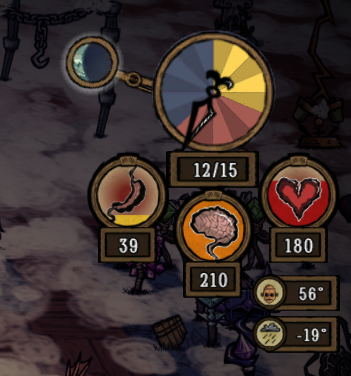

# 饥荒联机版客户端模组推荐

- 最初发布于 2022 年 2 月 23 日
- [源码][source]
- [网页][page]

[source]: https://raw.githubusercontent.com/liolok/liolok.com/master/zhs/dont-starve-together-client-mod/index.md
[page]: https://liolok.com/zhs/dont-starve-together-client-mod/

---

- [单人](#单人)
  - [Action Queue](#action-queue)
  - [Advanced Controls](#advanced-controls)
  - [Advanced Tooltips](#advanced-tooltips)
  - [Advanced Warning](#advanced-warning)
  - [Auto Unequip](#auto-unequip)
  - [Burning Timer](#burning-timer)
  - [Clock in Caves](#clock-in-caves)
  - [Combined Status](#combined-status)
  - [Craft Pot](#craft-pot)
  - [Craftables at First](#craftables-at-first)
  - [Crafting Guide](#crafting-guide)
  - [Entity Indicators](#entity-indicators)
  - [Geometric Placement](#geometric-placement)
  - [Misclick Protection](#misclick-protection)
  - [Nightmare Phase Indicator](#nightmare-phase-indicator)
  - [Save Equipment Slots](#save-equipment-slots)
  - [Stat Change Display](#stat-change-display)
  - [Wagstaff Tool Info](#wagstaff-tool-info)
- [联机](#联机)
  - [Announce Entities + Quick Stat Announce](#announce-entities--quick-stat-announce)
  - [Character Indicators](#character-indicators)
  - [Chat Enter Key Toggle](#chat-enter-key-toggle)
  - [Chat Shortcut Manager](#chat-shortcut-manager)
  - [Connect Directly to My Server](#connect-directly-to-my-server)
  - [Connection Manager](#connection-manager)
  - [Gesture Wheel](#gesture-wheel)
  - [Selective Emote Animations](#selective-emote-animations)
  - [Status Announcements](#status-announcements)
  - [Show Nicknames](#show-nicknames)

---

## 单人

这个分类下面都是即使单人游玩也强烈建议开启的模组，方便上手游戏的同时，游戏体验也不如原生那么硬核了（悲）。

对应的创意工坊合集：[Steam 创意工坊::客户端模组-单人](https://steamcommunity.com/sharedfiles/filedetails/?id=2761751472)

### Action Queue

这里推荐的是 null 维护的 RB2 版本，主要增加了种地相关支持：

- ID：`2325441848`
- [链接](https://steamcommunity.com/sharedfiles/filedetails/?id=2325441848)

默认绑定 LShift + 鼠标双击来批量操作，比如砍、挖、捡、种、采等等，可以设置双击速度、范围。

默认绑定 F3 切换显示附近地皮网格，默认半径 5 个地皮也就是以人物所在地皮为中心的 11*11 的地皮网格。

默认绑定 F4 切换自动收集（默认为关闭状态），操作队列中会增加捡起附近地面物品的操作，可用于砍树挖矿之类的场景。

默认绑定 C 键快速制作上一次制作过的东西，可用于连续制作的场景。

### Advanced Controls

- ID：`1601725838`
- [链接](https://steamcommunity.com/sharedfiles/filedetails/?id=1601725838)

物品方面：
- 使用光标或者 Shift + 右键将物品放到地面上时，自动对准距离最近的墙点再进行放置
  - 使用 Ctrl + Shift + 右键单独放置物品时强制放到人物脚下
- 禁止右键食用稀有物品的功能，比如巨鹿眼球、远古守护者的犀牛角、曼德拉草

攻击方面：
- 每次按下 F 重新选择距离最近的怪作为目标
- 墙需要用 Ctrl + 左键进行强制攻击
- 食人花、蜂王的小蜜蜂、蚁狮的沙刺需要强制攻击
- 使用韦伯角色时，蜘蛛需要强制攻击
- 装备骨头头盔时，影怪需要强制攻击

### Advanced Tooltips

原版早已停更，这里推荐的是 Viento Solar 维护的版本：
- ID：`1870100421`
- [链接](https://steamcommunity.com/sharedfiles/filedetails/?id=1870100421)

Tooltip 就是指光标悬停格子里的物品时，光标上方浮现的文字提示。这个模组主要展示以下信息：
- 食物的三维变动数值（据我测试是适配了机器人、恶魔人的）
- 食物距离腐烂的剩余时间：
  - 可以修改为各个阶段的剩余时间，如由绿变黄、由黄变红以及最终腐烂
  - 适配冰箱、保鲜背包、寒冰切斯特的二倍保鲜，盐箱的四倍保鲜，以及夏季冬季的环境温度影响
- 装备的伤害数值、防水百分比、保暖隔热数值、速度加成（需手动开启）
- 武器、工具的剩余使用次数/总使用次数
- 护甲的剩余血量/总血量
- 衣物、灯的剩余时长/总时长
- 暖石的温度，这个只对本地主机生效且不会实时更新，比较鸡肋
- 可以将装备图标上面的耐久度百分比改为剩余时长、剩余使用次数
- 可以将护甲图标上面的耐久度百分比改为剩余血量

所有涉及时长的值，默认大于游戏一天（现实八分钟）则为天数，例如：`5.8d/25d`小于游戏一天则为分秒，如：`6:34/7:48`。也可以统一改为分秒格式。

### Advanced Warning

- ID：`1923504381`
- [链接](https://steamcommunity.com/sharedfiles/filedetails/?id=1923504381)

在巨鹿、熊獾、猎犬、蠕虫、蚁狮的地陷和落石预警开始时，发出清晰直观的文字提示。可以调整成屏幕上方提示或者发送全房聊天消息。静音或者听歌的游玩场景下比较急需本模组。

### Auto Unequip

- ID：`2706972372`
- [链接](https://steamcommunity.com/sharedfiles/filedetails/?id=2706972372)

一些装备耐久度耗尽会直接消失不见，失去原本可能的修补机会，俗称爆掉。这个模组会在危急时刻自动取消装备，放回身上的格子。格子满了会拿到光标上，光标也被其他物品占用就会从身上掉落。

> 点评：建议仅作为保险措施，不要依赖于此。游玩过程中，各种装备的耐久度还是应该多加注意。

### Burning Timer

- ID：`2525856394`
- [链接](https://steamcommunity.com/sharedfiles/filedetails/?id=2525856394)

在所有燃烧的地方显示一个燃尽的倒计时，包括矮星、火堆、火把、放在地上的提灯这些。

### Clock in Caves

- ID：`2067930253`
- [链接](https://steamcommunity.com/sharedfiles/filedetails/?id=2067930253)

在洞穴时原生的时钟是黑的，有了这个模组就可以清晰的看到指针和刻度了。

### Combined Status

- ID：`376333686`
- [链接](https://steamcommunity.com/sharedfiles/filedetails/?id=376333686)

增加右上角的状态信息显示，主要是以下几点：

- 三维数值，光标悬停时在图标内显示最大值
- 玩家角色体温：
  - 0 度过冷，70 度过热，差 5 度时开始预警，更直观地判断体温变化趋势
- 世界环境温度（该选项需手动开启）
- 季节时钟：
  - Clock：默认模式，在时钟右方，并排加一个展示当前在所有季节中的进度的时钟
  - Micro：效果如上图，最直观展示这一天是在当前季节的第几天
  - Compact：类似 Micro 但在温度下方而非时钟下方，并且多一个当前季节名字
- 月相（默认仅出现在黄昏和夜晚，可改为全天侯显示）
  - 在光标悬停时显示预测的下一次月圆天数
- 玩家角色雨露值（位置在体温左方，三维下方）
- 人物专属数值（位置在三维左方）
- （可以）隐藏时钟上的世界天数，光标悬停时再显示。

> 点评：时钟的指针和刻度在没有被遮挡、不过多占用屏幕空间的同时，越大越清晰越好。可以考虑适当增大缩放倍数。

### Craft Pot

- ID：`727774324`
- [链接](https://steamcommunity.com/sharedfiles/filedetails/?id=727774324)

打开烹饪锅时在右侧显示一个类似制作栏列表的界面，包含所有菜品的食谱，实时预测当前锅内的食材会烹饪出哪（几）种菜品，并在更右侧的详情界面展示菜品对应的三维变动。

> 注：所有食谱都烂熟于胸或是想慢慢摸索体验，亦可跳过本模组。

### Craftables at First

- ID：`1851633087`
- [链接](https://steamcommunity.com/sharedfiles/filedetails/?id=1851633087)

改变左侧制作栏展开列表的排序，当前可以制作、已经制作好的项目会排在前面。

还有三个默认开启的选项：

1. 提高不可制作的项目的图标亮度、缩小锁头图标并移至角落
2. 制作栏已经打开时也改变列表排序（此处存疑，文档、代码均分析失败）
3. 手中（光标上，不是格子里）持有材料的项目排序更优先。

> 点评：可能很多老手已经把每种常用物品在列表中的位置形成肌肉记忆了，但我反正是每次滚轮翻列表都找不到要制作/放置的东西。私以为这个模组官方应当收编。

### Crafting Guide

- ID：`2741786011`
- [链接](https://steamcommunity.com/sharedfiles/filedetails/?id=2741786011)

覆盖原本的强制检查（force inspect）功能，默认键位 Alt + 左键点击物品，展示其作为材料有哪些制作配方。原生的制作栏是按照一定的分类展示制作配方，这个模组是根据材料展示制作配方。

有两个可配置项：

- 分组依据：
  - （默认）按制作栏分类
  - 是否已解锁
  - 不分组（我建议这个）
- 人物专属制作配方：
  - （默认）显示所有人物的
  - 只显示当前人物的
  - 全都隐藏（这没道理吧）

> 点评：说实话一种材料到底都能制作哪些东西、具体的配方是什么，玩这么久我自己也不是全都清楚，这样的一个反向查询真的很有帮助。个人还没有完全习惯这种全新的制作方式，不过确实很大程度上比制作栏要好用是真的。

### Entity Indicators

- ID：`2342521033`
- [链接](https://steamcommunity.com/sharedfiles/filedetails/?id=2342521033)

像原生设计中的附近玩家指示图标一样，指示屏幕范围外附近的各种特殊生物。主要是各种 Boss 级别的大型生物，也可以指示一些其他的实体比如切斯特、可疑的大理石等等，帮助玩家快速定位、规避风险。

### Geometric Placement

- ID：`351325790`
- [链接](https://steamcommunity.com/sharedfiles/filedetails/?id=351325790)

游戏原生设计里面，放置建筑只有红绿两种颜色示意能否放置。这个模组划定了很多十字格点并展示光标附近哪些点位的可放置情况。

默认绑定 B 键切换游戏内的模组配置菜单，可以方便地根据不同建造场景来切换各种细节比如对比颜色、物品图标是否显示等等，建议按需自行摸索。

> 需要注意的是，这个模组默认绑定了 V 键用于快速切换点位布局，如果游戏内聊天需要使用 Ctrl + V 粘贴文字，则会不经意间触发这个切换。如有困扰建议关掉这个快速切换的键位绑定。

> 点评：游戏原生设计是很自由的，玩家爱怎么造就怎么造，放置到哪里就是哪里。喜欢这种自由而非对齐强迫症患者的玩家请跳过本模组。

### Misclick Protection

- ID：`2669996375`
- [链接](https://steamcommunity.com/sharedfiles/filedetails/?id=2669996375)

（均需在模组设置中手动开启）各种魔杖、沃拓克斯的灵魂跳跃等原本单击右键的操作改为双击。

- 可以设置双击速度
- 不同的魔杖可以单独设置
- 魔杖拿在光标上也可以单独设置

### Nightmare Phase Indicator

- ID：`1298780476`
- [链接](https://steamcommunity.com/sharedfiles/filedetails/?id=1298780476)

直观清晰地展示洞穴世界当前处于哪个阶段、剩余的时长。默认在屏幕上方，可以自行调整位置、语言和缩放等细节。可以配合下文中的 Status Announcements 模组将当前阶段以及剩余时长作为消息发送聊天。

> 建议：调成中文的话，快捷宣告发出的消息语法是破碎的，我反正是用默认英语了。

### Save Equipment Slots

- ID：`1598084686`
- [链接](https://steamcommunity.com/sharedfiles/filedetails/?id=1598084686)

固定各种装备回到物品栏的哪个格子，提灯、火把、武器、防具这些急用的装备更容易找到了。

### Stat Change Display

- ID：`1876137475`
- [链接](https://steamcommunity.com/sharedfiles/filedetails/?id=1876137475)

在右上角三维图标处实时浮现所有的三维变动数值。

> 建议：把模组设置里面的字号调到最大，尽可能引起注意。

### Wagstaff Tool Info

- ID：`2595004536`
- [链接](https://steamcommunity.com/sharedfiles/filedetails/?id=2595004536)

天体英雄前置任务中收集约束静电时的辅助模组，帮助快速上手。

## 联机

这个分类下面的模组都是方便联机、交流用的。

对应的创意工坊合集：[Steam 创意工坊::客户端模组-联机](https://steamcommunity.com/sharedfiles/filedetails/?id=2761932805)

### Announce Entities + Quick Stat Announce

- ID：`2683677179`
- [链接](https://steamcommunity.com/sharedfiles/filedetails/?id=2683677179)

作为对 Status Announcements 的补充：

- 默认绑定 Z 键快速宣告自身的三维和体温，是四个信息在一条消息中发出的。
- 默认绑定 X 键快速宣告光标下的物体，比如遭遇了什么 Boss 或者是到达了什么特殊的地方。

> 点评：目前没有中文支持，问题不大，反正都是直接看数值之类的关键信息。

### Character Indicators

- ID：`2351915881`
- [链接](https://steamcommunity.com/sharedfiles/filedetails/?id=2351915881)

原生的附近玩家指示图标只显示角色头像，这个模组给人物头像加上了对应的皮肤。不同的玩家使用不同的角色一般都会区分皮肤，这样也方便辨认。

### Chat Enter Key Toggle

- ID：`2641093050`
- [链接](https://steamcommunity.com/sharedfiles/filedetails/?id=2641093050)

原生默认 Y 键进行全房间聊天，U 键进行附近区域私聊。这个模组增加了按回车键进行全房间聊天的功能。

### Chat Shortcut Manager

- ID：`2183209654`
- [链接](https://steamcommunity.com/sharedfiles/filedetails/?id=2183209654)

主要是用来快速输入表情符号，其他的功能还未探索。

### Connect Directly to My Server

- ID：`2532502421`
- [链接](https://steamcommunity.com/sharedfiles/filedetails/?id=2532502421)

在主界面右方加两个按钮用来设置和直连到特定服务器。比 Connection Manager 的操作少了一次点击，但是数量限制一个，各有利弊，建议搭配使用。

### Connection Manager

- ID：`2059140073`
- [链接](https://steamcommunity.com/sharedfiles/filedetails/?id=2059140073)

在主界面左下方增加一个直连按钮，展示一个可管理的服务器列表。在服务器中也可以使用计分板（默认 Tab 键调出的那个界面）左上方按钮来将当前服务器添加到直连列表。

### Gesture Wheel

- ID：`352373173`
- [链接](https://steamcommunity.com/sharedfiles/filedetails/?id=352373173)

默认绑定 G 键调出表情轮盘，使用光标选中动作表情快速发送。比如原生设计中需要手动敲 `/dance` 才能跳舞，这个模组方便得多。

### Selective Emote Animations

- ID：`1288881041`
- [链接](https://steamcommunity.com/sharedfiles/filedetails/?id=1288881041)

原生的动作表情里面有两个特殊的：`/sit` 和 `/squat`，分别都有两种实际的动作变体，这个模组做的事情就是如果做出了不想要的动作就重来一遍直到效果满意为止。

> 点评：我很久以来一直坚持手动完成以上步骤。

### Status Announcements

- ID：`343753877`
- [链接](https://steamcommunity.com/sharedfiles/filedetails/?id=343753877)

Alt + 左键点击各种界面（兼容前文提到的 Combined Status），宣告你能得到的各种信息：

- 兼容前文提到的 Combined Status：
  - 自身的三维、体温、雨露值
  - 当前季节还剩几天
- 制作栏以及制作配方界面：
  - 想要制作哪个物品
  - 制作某物品还缺少多少某种材料
  - 自身持有的某种材料足够制作多少某物品

Alt + Shift + 左键点击格子里的物品，宣告其位置（自身/箱子/冰箱等其他容器）、数量、新鲜度、耐久度等信息。

默认发送的是全房间聊天消息，加上 Ctrl 可以改为发送附近区域私聊消息。也可以修改设置修改默认为发送私聊，加 Ctrl 发送全房。

下面这个是天伤的汉化版。原版本身也是支持中文的，但是暖石的状态修饰语有点问题，而汉化版则是直接砍掉了这个特性。

- ID：`610528767`
- [链接](https://steamcommunity.com/sharedfiles/filedetails/?id=610528767)

### Show Nicknames

- ID：`956206484`
- [链接](https://steamcommunity.com/sharedfiles/filedetails/?id=956206484)

在所有玩家角色上方显示昵称。默认也显示自己的，可以在模组设置中关掉。

<!--
## 减法

这些模组都是给游戏本体做减法的，大多是图形界面，也有声音。

### Hide Stuff

- ID：`1536691420`
- [链接](https://steamcommunity.com/sharedfiles/filedetails/?id=1536691420)

这个 Stuff 范围还是蛮广的，挑着介绍一下，特殊声明「可以」的功能都需手动开启，其余都为默认开启：

- 可隐藏的：
  - （可以）平时向左侧收起制作栏，光标靠近自动展开（推荐）
  - 隐藏左上角闪烁的连接不稳图标（不推荐）
  - 隐藏左上角领取礼物的超大按钮，靠近科学机器/炼金引擎再现实（推荐）
  - （可以）隐藏光标选中物体的高亮（这没道理吧，不推荐）
  - 点击右上角切换所有的界面控件的显示/隐藏（可以用来沉浸式体验游戏或者录制视频？）
  - 隐藏加载界面左下角的「Loading...」或者说「正在加载...」（隐藏可以欣赏画面，显示可以判断游戏有没有卡死（笑）
  - 隐藏地图界面的边框（推荐）
  - 隐藏右下角地图按钮和旋转视角按钮这一套控件（推荐，这两个操作应当用快捷键）
  - （可以）隐藏宣告消息，原理是拦截所有以鼠标表情开头的消息。
- 光标操作提示（个人不建议隐藏）：
  - 隐藏航海时的「改变航向」「停止掌舵」操作提示
  - 隐藏懒人魔杖的右键传送提示和沃拓克斯的灵魂跳跃提示
- 可跳过的：
  - 帮你点击登录（然而现在原生支持自动登录了，会出现取消之后还要登录一次的尴尬情况）
  - 帮你确认退出（然而就看不到「查理会想你的」这句经典台词了）
  - 帮你领取每日礼物（唰一下子就领完了，一点感觉都没有）
  - 跳过模组警告（是的，很多模组只做的这一件事）

### Alpha Bunnies

- ID：`1583712314`
- [链接](https://steamcommunity.com/sharedfiles/filedetails/?id=1583712314)

调节兔人房的透明度，地表和洞穴可以分开设置。

### Alpha Pillars

- ID：`1288937992`
- [链接](https://steamcommunity.com/sharedfiles/filedetails/?id=1288937992)

调节洞穴中各种柱子、楼梯等遮挡视线的物体的透明度。

### Concealed Crown

- ID：`2585253003`
- [链接](https://steamcommunity.com/sharedfiles/filedetails/?id=2585253003)

隐藏启迪之冠那高高耸立遮挡视线、每次上下线/上下洞穴都会展开的五个格子。向下收起，只留边框，光标悬停自动展开。

### Mute Flies

- ID：`1213299911`
- [链接](https://steamcommunity.com/sharedfiles/filedetails/?id=1213299911)

静音便便/鸟粪的苍蝇嗡嗡声，平时地上的便便不一定能做到及时清理，时间久一点简直令人抓狂。效果上面还是能听到第一声（作为提示？），但是起码不会饱受长时间的摧残了。

### Mute Food Begging

- ID：`1856304267`
- [链接](https://steamcommunity.com/sharedfiles/filedetails/?id=1856304267)

静音宠物饥饿之后讨要食物的音效，如果连讨食的动画都看着烦的话就只能遗弃宠物了吧。

### Mute Pack

- ID：`1740358195`
- [链接](https://steamcommunity.com/sharedfiles/filedetails/?id=1740358195)

上面两个需求比较大众，如果还有其他需求可以看看这个。我订阅起因是绿洲建家被秃鹰落地之后持续的叫声快要逼疯，找了这个比较全面的静音模组。虽然最后更新时间在 2019 年，但里面真的有超多选项，如果吵到你的物体不在里面那可太惨了，不妨分享一下经历让大伙乐乐。

> 注：关于静音方面见得多一些的是伍迪的露西斧，看了一下这个模组里面还真有，露西斧在第 10 个分类「玩家」里面，仔细翻一下就能找到了。

## 角色

这个分类下面都是角色专属物品/技能相关的，基于你玩哪个、一起游玩的有哪些角色，再按需订阅、开启相关模组就可以了。

> 注意：由于我玩的角色很少，难免有什么遗漏，欢迎交流！

### AutoGym

- ID：`2679603410`
- [链接](https://steamcommunity.com/sharedfiles/filedetails/?id=2679603410)

自动操作大力士的健身台

### Configurable Lucy Silencer

- ID：`2724432257`
- [链接](https://steamcommunity.com/sharedfiles/filedetails/?id=2724432257)

通用模组里已经介绍了怎么静音伍迪的露西斧，至于她话痨时的文字想要隐藏就得专门的模组了。我找到了这个，可以音效和文本分开设置。

### Non-Clickable Balloons

- ID：`2444884963`
- [链接](https://steamcommunity.com/sharedfiles/filedetails/?id=2444884963)

使维斯的气球无法被直接攻击甚至点击

### Wortox Quick Heal

- ID：`1704104804`
- [链接](https://steamcommunity.com/sharedfiles/filedetails/?id=1704104804)

默认绑定 R 键快速释放沃拓克斯持有的灵魂。

### Wortox Indicators Standalone

- ID：`2087419015`
- [链接](https://steamcommunity.com/sharedfiles/filedetails/?id=2087419015)

默认绑定 X 键切换显示，红圈是沃拓克斯的群体治疗范围，绿圈是他的灵魂跳跃范围。

-->
