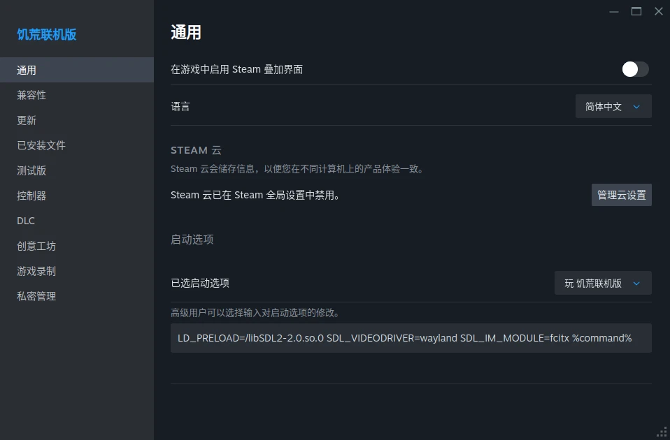

# 饥荒联机版个人笔记

## 专用服务端无法下载创意工坊模组

使用 SteamCMD 自带的 `steamclient.so` 替换掉专用服务端安装目录下面的同名文件。

## Linux 原生客户端中文乱码

使用字体模组可以很大程度缓解次问题，推荐一下自用的[仓耳玄三](https://steamcommunity.com/sharedfiles/filedetails/?id=3264922393)。

或者使用 Proton 运行客户端，没有亲自体验过。

## Linux 下使用 Wayland 以及 fcitx5 输入法

需要用打了[补丁](https://ccat3z.xyz/posts/dont-starve-custom-sdl2/)的 SDL2 运行库进行替换，这里有群友编译好的 [libSDL2-2.0.so.0.3200.2](./libSDL2-2.0.so.0.3200.2)。

给 Steam 的饥荒联机版客户端加上启动选项：

```
LD_PRELOAD=/libSDL2-2.0.so.0 SDL_VIDEODRIVER=wayland SDL_IM_MODULE=fcitx %command%
```

其中 `LD_PRELOAD` 的内容需要对应实际用来替换的运行库文件路径，而 `SDL_IM_MODULE` 则是为了解决[按键走位抖动问题](https://www.csslayer.info/wordpress/linux/key-repetition-and-key-event-handling-issue-with-wayland-input-method-protocols/)。


