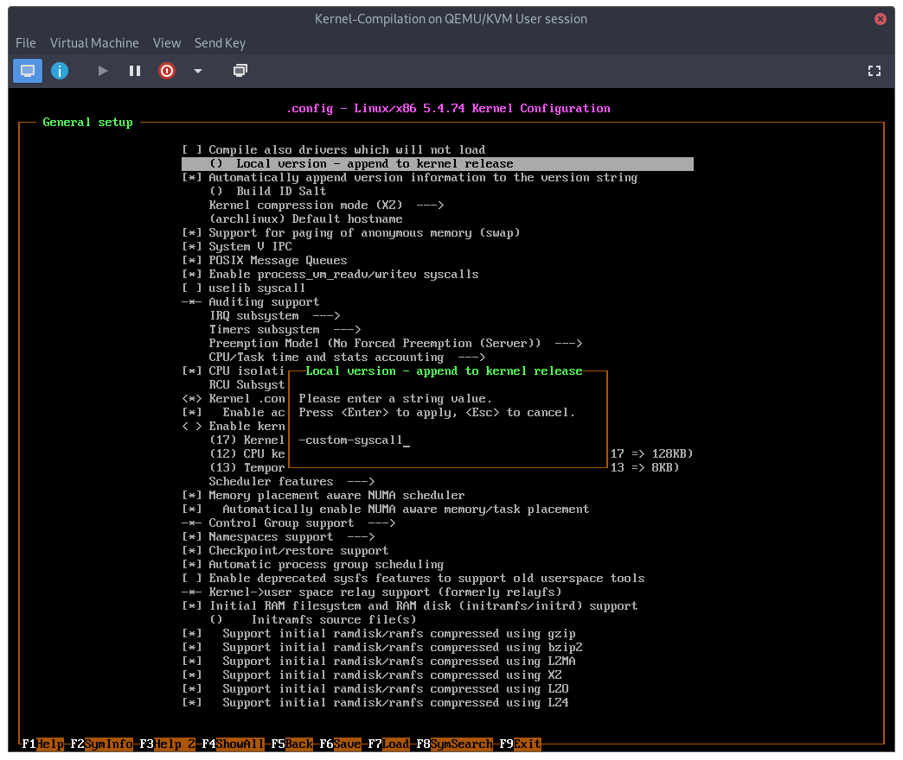
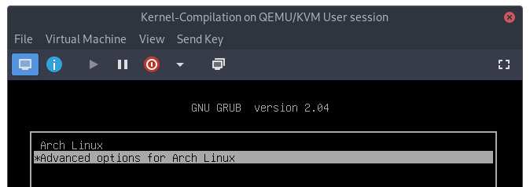
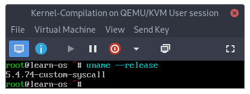
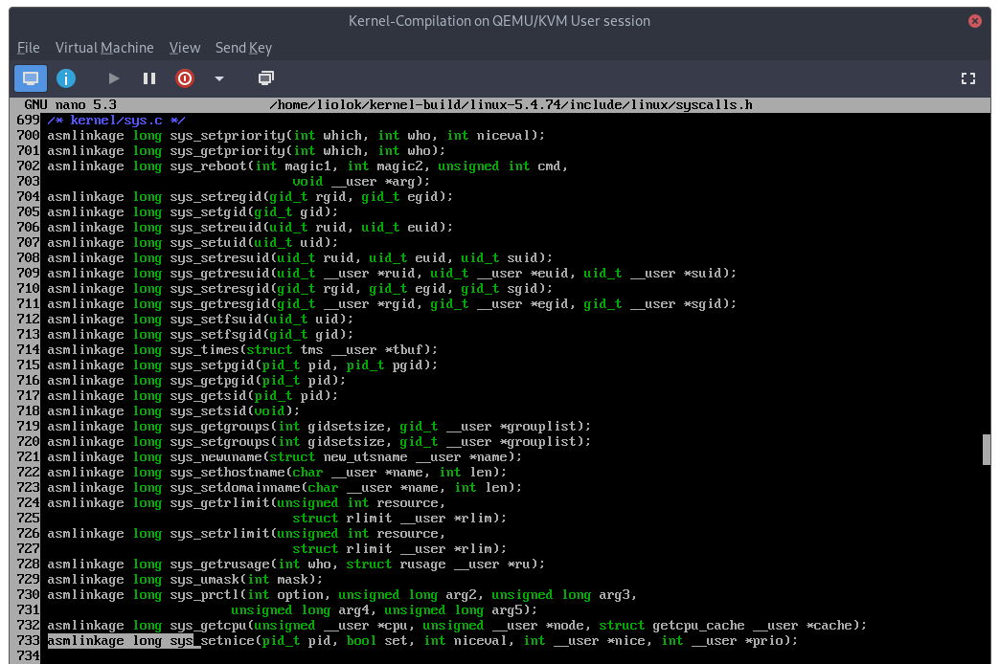
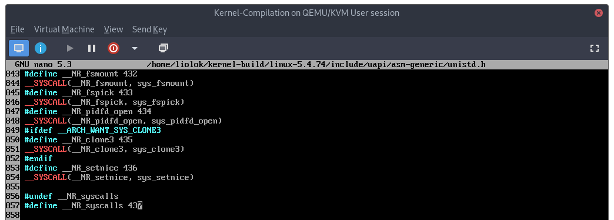
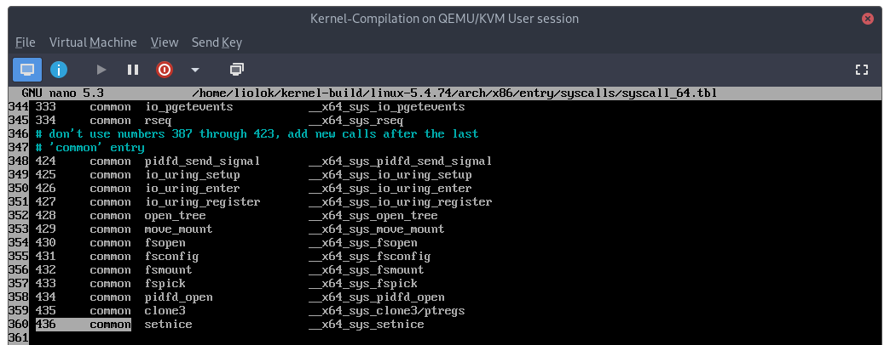
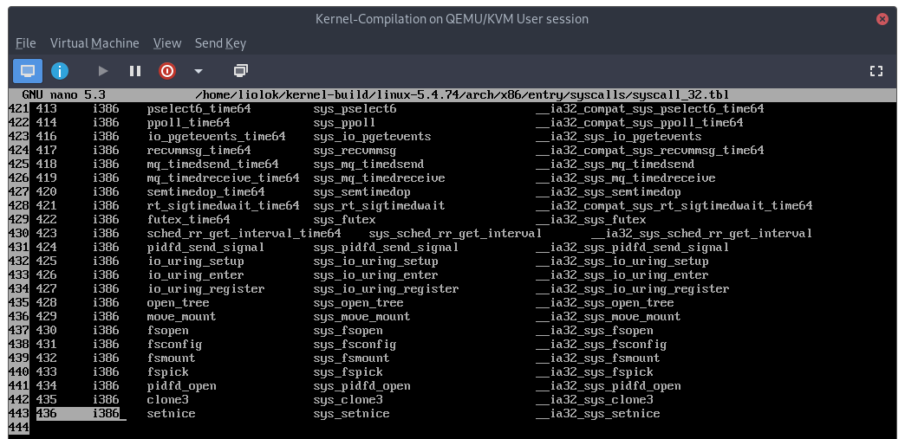
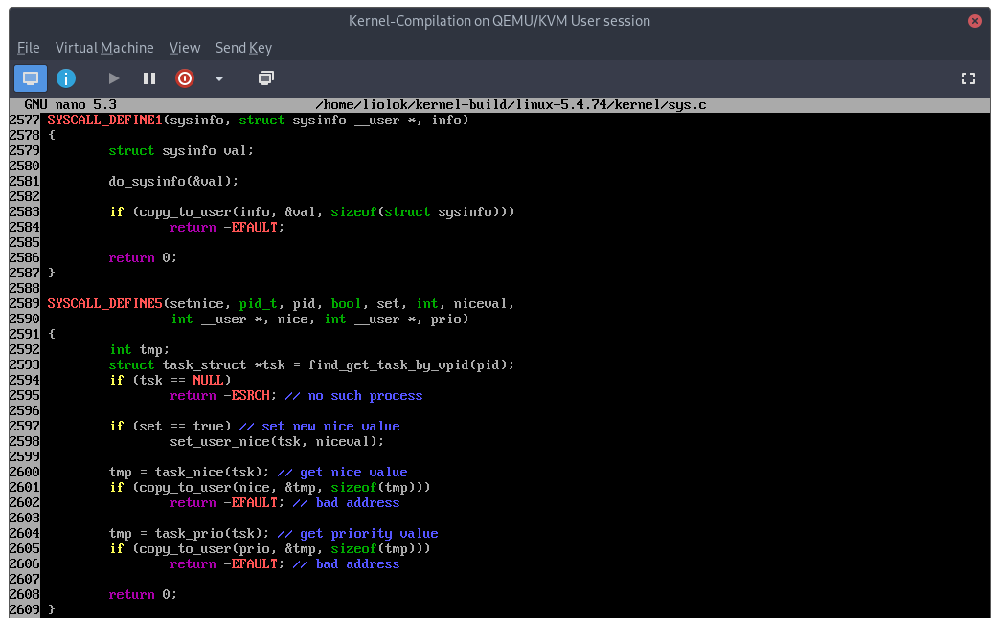
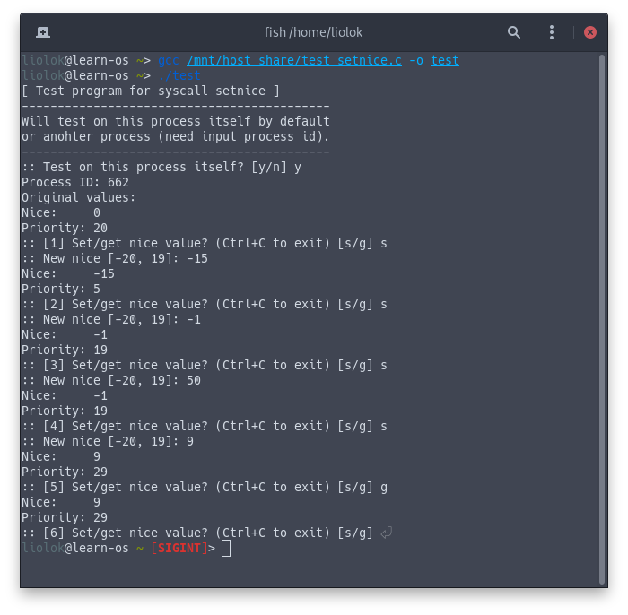

# Linux 内核编译及添加系统调用

## 关于本文

杭电操作系统实验一，个人笔记。

- 最初发布于 2018 年 7 月 22 日
- 最后更新于 2020 年 12 月 12 日
- [源码][source]
- [网页][page]

[source]: https://github.com/liolok/liolok.com/blob/master/zhs/kernel-compilation-with-custom-syscall/index.md
[page]: https://liolok.com/zhs/kernel-compilation-with-custom-syscall/

## 写在最前

写给 Linux 命令行新人的一点人生经验：

- 路径开头的「/」是根目录，「~」是用户家目录；注意分隔符也是斜杠「/」不是转义用的反斜杠；
- 命令提示符为「#」指该命令以 root 权限执行；「$」则意味着以其他用户身份执行命令；
- 想要知道命令的作用：看全名/描述，比如 `whatis ls` 会告诉你 ls 是 list directory contents；
- 想要知道命令的用法/选项的含义：看文档（如 `man cd`）或者帮助（如 `cd --help`），本文中所有选项都已展开成全称。

## 系统环境

建议使用带有快照功能的虚拟化平台，发行版采用 Arch Linux 是因为有官方文档可以参考。

创建虚拟机时其他选项建议跟随默认，主要建议以下几点：

- 处理器直接拉满，尽量发挥物理机处理器全部性能；
- 内存不低于 4G，实在不够的话建议后续分区时加一个 2G 的交换分区或者使用交换文件；
- 磁盘不小于 50G，编译过程中会生成额外的文件，尽量确保预留足够的磁盘空间，以免后续调整麻烦。

安装 Arch Linux 请认真参阅官方文档的[安装教程][archwiki_1]，以下只列出几点虚拟机中需要注意的：

1. 分区表：虚拟机通常默认为 BIOS 启动方式，建议磁盘分区采用 MBR 分区表，如 `cfdisk` 工具中选择 `dos` 类型的分区表类型；
2. 分区方案：全盘只分一个区来挂载根目录即可，注意该分区要设为 bootable（也可能是 boot flag 字样）；

### 镜像源

最近 archiso 新加入了基于 Reflector 自动排序镜像的功能，不过我觉得还是手动设置一下比较稳妥。

国内镜像源里面清华、中科大知名度都太高了，负载高反倒体验差；建议使用北外源，也是清华提供的技术支持。

```console
# cd /etc/pacman.d/
# mv --verbose mirrorlist{,.backup}
# host='https://mirrors.bfsu.edu.cn'
# echo "Server = $host/archlinux/\$repo/os/\$arch" > mirrorlist
# cat mirrorlist
```

检查 `mirrorlist` 文件内容已被修改成 `Server = https://mirrors.bfsu.edu.cn/archlinux/$repo/os/$arch` 即可。

### 软件包

#### 基础

```console
# pacstrap /mnt base linux-lts grub dhcpcd
```

- `base` 是 Arch Linux 必需的最基础包组；
- `linux-lts` 是 Arch Linux 官方的长期支持版 Linux 内核，落笔时的版本是 5.4.73；
- `grub` 是启动加载器，[安装][archwiki_2]完成后一定不要忘记[生成配置文件][archwiki_3]，别问我怎么记住的；
- `dhcpcd` 是 DHCP 客户端，重启进入安装好的系统后执行 `systemctl enable --now dhcpcd` 即可永久开启虚拟机内的网络功能；

[archwiki_1]: https://wiki.archlinux.org/index.php/Installation_guide_(简体中文) "Installation guide (简体中文) - ArchWiki"
[archwiki_2]: https://wiki.archlinux.org/index.php/GRUB_(简体中文)#安装 "GRUB (简体中文) - ArchWiki"
[archwiki_3]: https://wiki.archlinux.org/index.php/GRUB_(简体中文)#生成主配置文件 "GRUB (简体中文) - ArchWiki"

#### 工具

```console
# pacman --sync wget progress nano
```

这三个软件包分别是后续步骤中下载、查看解压进度、编辑源码用到的工具。

#### 构建

```console
# pacman --sync base-devel xmlto kmod inetutils bc libelf git
```

具体构建依赖应以 ArchWiki 为准：[Kernels/Traditional compilation - ArchWiki](https://wiki.archlinux.org/index.php/Kernels/Traditional_compilation)

### 创建非特权用户

准备工作**不需要**也**不建议**使用 root 权限操作，创建并切换至非特权用户，此处的 `liolok` 是我的 ID。

```console
# useradd --create-home liolok
# passwd liolok
# su --login liolok
```

### 创建构建目录

创建一个目录，存放内核源码，并进行编译及构建。

笔者使用的内核构建目录是 `~/kernel-build`，其中「~」表示上一步骤创建的用户主目录 `/home/liolok`。

```console
$ mkdir ~/kernel-build && cd ~/kernel-build # make and change to build directory
```

为什么不用 `/usr/src/linux`：

`/usr/src` 这个目录确实应用来存放各种源码，但应仅用作参考（reference），而不应进行构建。
（参见 [Linux 文件系统层次结构标准][fhs]）

[fhs]: https://refspecs.linuxfoundation.org/FHS_3.0/fhs/ch04s12.html "4.12. /usr/src : Source code (optional)"

## 内核编译

### 下载解压

Linux 内核官网：[The Linux Kernel Archives](https://www.kernel.org/)

届时最新的 LTS 版本号是 5.4.74（2020.11.01），为了下载得更快推荐使用国内的镜像源（同上文，采用北外源）：

```console
$ version='5.4.74'
$ host='https://mirrors.bfsu.edu.cn'
```

内核源码压缩包的文件格式是 `.tar.xz`（也有 `.tar.gz`），tar 是打包/归档工具，xz/gz 是压缩工具，至于 `.tar.sign` 文件是用于验证的签名。

使用 `wget` 进行下载和解压的方法：

```console
$ pwd # you should be working under `~/kernael-build`
$ wget $host/kernel/v5.x/linux-$version.tar.{xz,sign}
$ unxz linux-$version.tar.xz & progress --monitor --pid $!
```

完成后构建目录下应该有解压之后的 `.tar` 文件和 `.tar.sign` 签名。

### 验证签名

本步骤参考 Linux 内核官方文档：[Using GnuPG to verify kernel signatures](https://www.kernel.org/signature.html#using-gnupg-to-verify-kernel-signatures)。

下载并导入两位内核主要作者的公匙，验证源码的完整性。如果下载到的文件本身就是损坏的，那编译成功也有可能工作不正常。

```console
$ gpg --locate-keys torvalds@kernel.org gregkh@kernel.org # download and import keys
$ gpg --verify linux-$version.tar.sign # verify the .tar archive against the signature
```

不用管有没有 warning，输出中有「Good signature」字样即可，否则说明源码归档包已损坏。

此时建议为虚拟机创建一个快照，后面即将开始折腾。

### 解包源码

现在只需将其解包到同名子目录即可得到内核的源代码：

```console
$ tar --extract --file=linux-$version.tar & progress --monitor --pid $!
$ cd linux-$version
```

这个步骤我们得到了内核源码的未修改版，也可以做个快照。

### 清理编译历史

每次编译前，都要确保目录下的编译历史已被清理干净，同样也不要指望刚解包得到的源码目录就一定是干净的。

```console
$ make mrproper # ensure the kernel tree is absolutely clean
```

### 导入默认配置

这里修改 local version 是为内核版本号追加一个后缀，虽然不是必需的，但也方便后续验证编译成果。

```console
$ zcat /proc/config.gz > .config # use Arch Linux default configuration
$ make nconfig # append your custom local version string
```



输入自定义的版本后缀后，按 F6 保存配置、F9 退出。

### 编译内核

使用 `time` 命令可为编译计时；使用 `--jobs=X` 选项可并行工作以加快编译，其中 `X` 为处理器线程数，对应虚拟机的配置。

```console
$ time make --jobs=8 # compile kernel
```

### 编译内核模块

注意！接下来的步骤均需要以 root 身份进行操作，使用 `su` 切换至 root 用户继续后续操作。

```console
# make modules_install # compile kernel modules
```

## 安装内核

### 可执行文件

```console
# cp --verbose ./arch/x86_64/boot/bzImage /boot/vmlinuz-linux-custom # 64-bit kernel
```

此处的 `bzImage` 和 `vmlinuz-linux-custom` 是编译内核及模块得到的压缩可执行文件；命名是约定俗成的，可以自行修改后缀如 `vmlinuz-linux-blabla`，后续步骤中还会用到。

### 初始化内存盘

拷贝一份已有的 `mkinitcpio preset` 并加以修改，便可用于生成对应内核的 initramfs 镜像。

```console
# cp --verbose /etc/mkinitcpio.d/linux-lts.preset /etc/mkinitcpio.d/linux-custom.preset # copy a preset
```

此处如果提示找不到 `linux-lts.preset`，可使用 `ls /etc/mkinitcpio.d` 查看实际文件名称。

```console
# nano /etc/mkinitcpio.d/linux-custom.preset # modify copied preset
```

进行如下修改:

```
...
ALL_kver="/boot/vmlinuz-linux-custom"
...
default_image="/boot/initramfs-linux-custom.img"
...
fallback_image="/boot/initramfs-linux-custom-fallback.img"
```

最后，为内核生成 initramfs 镜像。

```console
# mkinitcpio --preset linux-custom # generate initramfs images
```

### 符号表

```console
# cp --verbose ./System.map /boot/System.map-linux-custom
# ln --verbose --symbolic --force /boot/System.map-linux-custom /boot/System.map # create a symlink
```

### 更新引导配置

至此，使用 `ls /boot` 检查，应已新增以下文件：

- 可执行文件: vmlinuz-linux-custom
- 初始化内存盘: initramfs-linux-custom.img 和 initramfs-linux-custom-fallback.img
- 符号表: System.map-linux-custom 以及 System.map

让 GRUB 自动识别新安装到 /boot 的内核并将其添加至引导菜单：

```console
# grub-mkconfig --output=/boot/grub/grub.cfg # update grub configuration
```

### 重启至新内核

重启后在 GRUB 引导菜单的高级选项中选择新编译安装好的内核：




进入系统后使用 `uname --release` 命令可以看到之前自定义的版本号后缀，说明已切换至新内核：



## 添加系统调用

[Adding a New System Call — The Linux Kernel documentation](https://www.kernel.org/doc/html/v5.4/process/adding-syscalls.html?#generic-system-call-implementation "Adding a New System Call — The Linux Kernel documentation")

在刚刚编译的官方内核的基础上，添加一个自定义的系统调用 `setnice`，功能如下：

1. 按需修改指定进程的 nice 数值；
2. 读取该进程的 nice 与优先级（priority）的数值。

为了添加系统调用，要对此前的官方内核源码进行微量的修改：

```console
$ cd ~/kernel-build/linux-$version # kernel source code directory
```

[绝大多数情况][compatibility]下，内核会透明地处理指针，从而向旧兼容 32 位的用户空间程序。
对于我们要添加的简单系统调用而言，不需要另外单独实现 32 位兼容版本。

[compatibility]: https://www.kernel.org/doc/html/v5.4/process/adding-syscalls.html?#compatibility-system-calls-generic "a couple of situations where a compatibility layer is needed to cope with size differences between 32-bit and 64-bit"

### 函数原型

系统调用的函数原型位于内核源码目录下的 `./include/linux/syscalls.h`：



### 系统调用表

#### 通用系统调用表

通用系统调用表位于 `./include/uapi/asm-generic/unistd.h`，
按对应格式在列表末尾追加表项（**注意**也要相应的增加 `__NR_syscalls` 的值）：



#### x86 系统调用表

[Adding a New System Call — The Linux Kernel documentation](https://www.kernel.org/doc/html/v5.4/process/adding-syscalls.html?#x86-system-call-implementation "Adding a New System Call — The Linux Kernel documentation")

x86 架构的系统调用表位于 `./arch/x86/entry/syscalls/syscall_{64,32}.tbl` 两个文件中，按对应格式在列表末尾追加表项：



（`common` 代表 64 位版本的系统调用向旧兼容 32 位用户空间程序；如前文所说，我们自定义的简单系统调用可以通过内核的透明处理自动兼容。）



### 入口点

系统调用的入口点通常位于 `./kernel/sys.c` 文件中:



```C
/*
 * Set/get nice value and get priority value of a process with given ID;
 * Set new nice value only if parameter set is true;
 * Get values of nice and priority of the process at last.
 */
SYSCALL_DEFINE5(setnice, pid_t, pid, bool, set, int, niceval,
                int __user *, nice, int __user *, prio)
{
    int tmp;
    struct task_struct *tsk = find_get_task_by_vpid(pid);
    if (tsk == NULL)
        return -ESRCH; // no such process

    if (set == true) // set new nice value
        set_user_nice(tsk, niceval);

    tmp = task_nice(tsk); // get nice value
    if (copy_to_user(nice, &tmp, sizeof(tmp)))
        return -EFAULT; // bad address

    tmp = task_prio(tsk); // get priority value
    if (copy_to_user(prio, &tmp, sizeof(tmp)))
        return -EFAULT; // bad address

    return 0;
}
```

宏定义 [`SYSCALL_DEFINE5()`][code_1]：

- 数字取值范围为 [0, 6]，代表系统调用的参数个数；
- 括号内第一个参数为系统调用名称，其后是成对出现的参数类型和参数名称。

如上图中的 `SYSCALL_DEFINE1(sysinfo, struct sysinfo __user *, info)` 声明了名为 `sysinfo` 的系统调用，
其第一个也是唯一的参数是类型为 `struct sysinfo __user *` 的 `info`。

而我们添加的系统调用 `setnice` 有五个参数：

1. [`pid_t`][pid_t]（`int` 的一个别名）类型的 `pid`（number）：进程 ID 数字；
2. `bool` 类型的 `set`：为真则修改进程的 nice 数值
3. `int` 类型的 `niceval`：用于修改进程 nice 数值；
4. `int __user *` 类型的 `nice`：用于读取进程的 nice 数值；
5. `int __user *` 类型的 `prio`：用于读取进程的优先级数值。

宏定义 [`__user`][user] 是用于[内核静态分析][wiki-sparse]的用户空间地址的注解，表示该指针不可直接解引用（dereference）。可以看到后面我们会用到 [`copy_to_user()`][copy_to_user] 函数来安全地操作。（参见 StackOverflow 上的[这个回答](https://stackoverflow.com/a/38087885)）

[code_1]: https://elixir.bootlin.com/linux/v5.4.74/source/include/linux/syscalls.h#L218
[pid_t]: https://elixir.bootlin.com/linux/v5.4.74/source/include/linux/types.h#L22
[user]: https://elixir.bootlin.com/linux/v5.4.74/source/include/linux/compiler_types.h#L8
[wiki-sparse]: https://en.wikipedia.org/wiki/Sparse "Sparse - Wikipedia"
[copy_to_user]: https://elixir.bootlin.com/linux/v5.4.74/source/include/linux/uaccess.h#L149

函数 [`find_get_task_by_vpid()`][find_get_task_by_vpid]：在当前 [PID 命名空间][pid_ns]中查找 [PID][pid] 并得到其对应的 [PCB][pcb]。整个过程是一个临界区，使用了 [RCU (Read-Copy-Update) 机制][wiki-rcu] 来实现对 PID 命名空间中 [PID 基数树][pid_ns_idr]的保护。

[find_get_task_by_vpid]: https://elixir.bootlin.com/linux/v5.4.74/source/kernel/pid.c#L358
[pid_ns]: https://elixir.bootlin.com/linux/v5.4.74/source/include/linux/pid_namespace.h
[pid]: https://elixir.bootlin.com/linux/v5.4.74/source/include/linux/pid.h#L59
[pcb]: https://elixir.bootlin.com/linux/v5.4.74/source/include/linux/sched.h#L624
[wiki-rcu]: https://en.wikipedia.org/wiki/Read-copy-update "Read-copy-update - Wikipedia"
[pid_ns_idr]: https://elixir.bootlin.com/linux/v5.4.74/source/include/linux/idr.h

函数 [`set_user_nice()`][set_user_nice] 粗略分析：

[set_user_nice]: https://elixir.bootlin.com/linux/v5.4.74/source/kernel/sched/core.c#L4585

```C
void set_user_nice(struct task_struct *p, long nice)
{
	bool queued, running; // 进程是否在运行队列中、进程是否正在运行
	int old_prio, delta; // 原优先级、变化量
	struct rq_flags rf;
	struct rq *rq;

    // 新的 nice 值与原值相同或者超出范围则直接返回
	if (task_nice(p) == nice || nice < MIN_NICE || nice > MAX_NICE)
		return;
	/*
	 * We have to be careful, if called from sys_setpriority(),
	 * the task might be in the middle of scheduling on another CPU.
	 */
	rq = task_rq_lock(p, &rf); // 获取进程所在的运行队列，并使用自旋锁保护运行队列以及进程的优先级继承数据结构
	update_rq_clock(rq); // 更新运行队列时钟？

	/*
	 * The RT priorities are set via sched_setscheduler(), but we still
	 * allow the 'normal' nice value to be set - but as expected
	 * it wont have any effect on scheduling until the task is
	 * SCHED_DEADLINE, SCHED_FIFO or SCHED_RR:
	 */
	if (task_has_dl_policy(p) || task_has_rt_policy(p)) {
		p->static_prio = NICE_TO_PRIO(nice);
		goto out_unlock;
	}
	queued = task_on_rq_queued(p); // (p->on_rq == TASK_ON_RQ_QUEUED)
	running = task_current(rq, p); // (rq->curr == p)
	if (queued)
		dequeue_task(rq, p, DEQUEUE_SAVE | DEQUEUE_NOCLOCK); // 「伪」出列，尽量保留状态，不更新时钟
	if (running)
		put_prev_task(rq, p); // 暂停运行

	p->static_prio = NICE_TO_PRIO(nice); // ((nice) + DEFAULT_PRIO) == (120 + nice)
	set_load_weight(p, true);
	old_prio = p->prio;
	p->prio = effective_prio(p); // 对于常规进程，本质上是将前面算好的 static prio 赋值给 prio
	delta = p->prio - old_prio; // 计算优先级变化量

	if (queued) {
		enqueue_task(rq, p, ENQUEUE_RESTORE | ENQUEUE_NOCLOCK); // 修改完毕，「伪」入列
		/*
		 * If the task increased its priority or is running and
		 * lowered its priority, then reschedule its CPU:
		 */
		if (delta < 0 || (delta > 0 && task_running(rq, p))) // ？task_running() v.s. task_current()
			resched_curr(rq); // 重新调度当前运行队列
	}
	if (running)
		set_next_task(rq, p); // 继续运行
out_unlock:
	task_rq_unlock(rq, p, &rf);
}
```

分析优先级的[头文件][prio.h]以及函数 [`task_nice()`][task_nice] 和 [`task_prio()`][task_prio] 可以总结出，对于**常规**进程而言：

- nice 取值范围为 [-20, 19]；
- `static_prio`、`normal_prio`、`prio` 三者是相同的；
- 优先级取值范围是 [100, 139]，由默认值 120 和用户的 nice 值来调整；
- 呈现给用户的优先级数值还要再减去实时进程优先级最大值 `MAX_RT_PRIO` 即 100，最终范围是 [0, 39]。

[task_nice]: https://elixir.bootlin.com/linux/v5.4.74/source/include/linux/sched.h#L1598
[task_prio]: https://elixir.bootlin.com/linux/v5.4.74/source/kernel/sched/core.c#L4697
[prio.h]: https://elixir.bootlin.com/linux/v5.4.74/source/include/linux/sched/prio.h

### 重新编译内核

添加了系统调用的少量代码后，重新编译内核从而运行该系统调用；具体步骤应从[清理编译历史](#清理编译历史)开始。

### 测试系统调用

编写一个用户态程序以测试新添加的系统调用，如笔者的 `test_setnice.c` 代码如下：

```C
#include <sys/syscall.h> // syscall()
#include <unistd.h> // pid_t, getpid()
#include <stdio.h> // scanf(), printf()

#define __NR_setnice 436 // syscall name and number

int main(void)
{
    printf("[ Test program for syscall setnice ]\n");
    printf("-------------------------------------------\n");
    printf("Will test on this process itself by default\n");
    printf("or anohter process (need input process id).\n");
    printf("-------------------------------------------\n");
    printf(":: Test on this process itself? [y/n] ");

    pid_t pid; // pid number
    char choice;
    scanf("%c%*c", &choice); // choose process to test
    if (choice != 'y') {
        printf(":: Process ID: ");
        scanf("%d", &pid);
    }
    else {
        pid = getpid();
        printf("Process ID: %d\n", pid);
    }
    choice = 'g'; // get nice value at first time
    printf("Original values:\n");
    int count = 1;
    do {
        int err, niceval, nice, prio;
        int set = (choice != 'g');
        if (set) {
            printf(":: New nice [-20, 19]: ");
            scanf("%d%*c", &niceval);
        }
        if (err = syscall(__NR_setnice, pid, set, niceval, &nice, &prio)) {
            printf("Error %d, test terminated.\n", err);
            return err;
        }

        printf("Nice:     %d\n", nice);
        printf("Priority: %d\n", prio);
        printf(":: [%d] Set/get nice value? (Ctrl+C to exit) [s/g] ", count++);
    } while (scanf("%c%*c", &choice) != EOF);
}
```

在终端下编译运行并进行测试，结果如下：


